# Managing Microsoft Teams
 
### Overall Estimated Duration: 9 Hours

>**Note**: You have a **3-day + 8 hrs access window** with a maximum **combined VM uptime of 32 hours** shared between **Client1 and Client2**. Please note that running both VMs simultaneously will consume the allotted time at twice the rate. Once the 32-hour limit is reached, access will be permanently unavailable. To conserve your allocated time, always Stop or Deallocate both VMs from the Resources tab after use. The VMs will automatically deallocate after 15 minutes of inactivity and can be restarted anytime through Actions > Start. (see [Managing Your Virtual Machine](#managing-your-virtual-machine) for details).

## Overview
 
The MS-700 Managing Microsoft Teams lab provides a comprehensive, hands-on environment designed to teach administrators how to configure, deploy, and secure the Microsoft Teams ecosystem. The lab structure begins with governance and lifecycle management, focusing on setting up administrative roles, managing group creation permissions, and establishing retention and archiving policies. It then moves into external collaboration, demonstrating how to securely manage guest access and configure external domain federation. A major portion of the lab is dedicated to structural organization and the compliance policy engine, where admins learn to create Standard, Private, and Shared channels, manage app permission sets, and configure distinct meeting, calling, and messaging policies for different user groups. Finally, the lab covers advanced telephony features, such as setting up phone numbers, call queues, and auto-attendants, while leveraging the Call Quality Dashboard (CQD) for troubleshooting. Ultimately, the lab aims to ensure administrators are equally proficient using the visual Teams Admin Center (TAC) and scripting automated bulk changes using a combination of the Microsoft Teams and Microsoft Graph PowerShell modules.
 
## Objective
 
- **Configure Governance & Collaboration:** Assign admin roles, manage the team lifecycle (archiving/expiration), and secure guest and external access.

- **Manage Architecture & Apps:** Create standard, private, and shared channels, and control app deployment via permission policies.

- **Deploy Communication Policies:** Create, modify, and assign custom meeting, messaging, and calling policies to users and groups.

- **Setup Voice & Telephony:** Configure phone numbers, emergency routing, auto-attendants, and call queues.

- **Monitor & Troubleshoot:** Analyze call quality logs via the Call Quality Dashboard (CQD) and resolve connectivity issues.

- **Automate Administration:** Perform bulk configuration changes efficiently using both the Teams Admin Center and PowerShell modules.
 
## Explanation of Teams Components

### 1. The Core Infrastructure (Where files & data live)
Teams doesn't actually store your data; it acts as a frontend dashboard that connects to other Microsoft services behind the scenes:

*   **Microsoft 365 Groups:** The user membership engine. Creating a Team automatically builds a hidden M365 Group to control who has access.
*   **SharePoint Online:** Powers **Channel files**. Every Team gets its own SharePoint site. Files uploaded inside a standard channel are stored here.
*   **OneDrive for Business:** Powers **Private Chats**. When you send a file directly to a coworker in a 1-on-1 chat, it uploads to your personal OneDrive and shares it with them.

### 2. Channels (The workspaces)
Channels keep your team conversations organized. There are three types:

*   **Standard (Public):** Open and visible to all members of the Team.
*   **Private:** Hidden spaces restricted to a specific sub-set of team members (e.g., just the managers).
*   **Shared:** Collaborative spaces where you can invite external partners from *outside* your company without forcing them to switch tenants.

### 3. The Policy Engine (The rules)
Administrators use **Policies** to dictate what users can and cannot do:

*   **Messaging Policies:** Control chat rules, such as whether users can edit/delete sent messages or use GIFs.
*   **Meeting Policies:** Control audio, video, and sharing features during calls (e.g., who can share screens or bypass the lobby).
*   **App Policies:** Control which third-party or custom apps users are allowed to install and pin to their sidebar.

### 4. Calling & Voice (The phone system)
This turns Teams into a cloud-based business phone system connected to the traditional telephone network (PSTN):

*   **Calling Plans:** Gives users a real, assignable phone number to place and receive outside calls.
*   **Auto Attendants:** The automated voice menus that route inbound callers (e.g., *"Press 1 for Support, Press 2 for Billing"*).
*   **Call Queues:** The waiting lines that hold callers on the line and distribute them to available agents in a specific order.
 
## Getting Started with the lab
 
Welcome to your Capstone Project Workshop, Let's begin by making the most of this experience:
 
## Accessing Your Lab Environment
 
Once you're ready to dive in, your virtual machine and **Guide** will be right at your fingertips within your web browser.
 
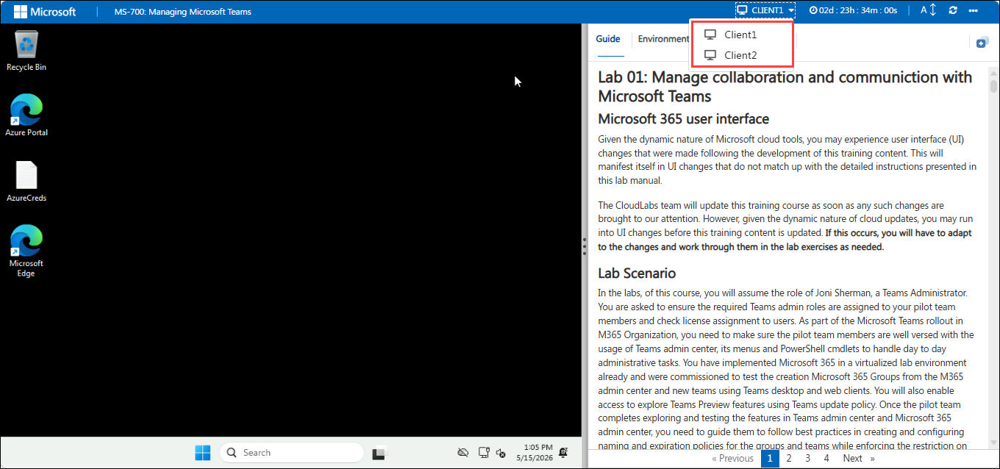
 
## Lab Guide Zoom In/Zoom Out
 
To adjust the zoom level for the environment page, click the **A↕ : 100%** icon located next to the timer in the lab environment.

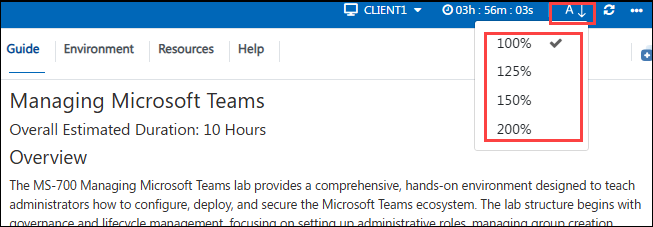
 
## Virtual Machine & Lab Guide
 
Your virtual machine is your workhorse throughout the workshop. The lab guide is your roadmap to success.
 
## Exploring Your Lab Resources
 
To get a better understanding of your lab resources and credentials, navigate to the **Environment** tab.
 
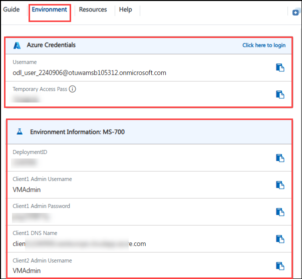
## Utilizing the Split Window Feature
 
For convenience, you can open the lab guide in a separate window by selecting the **Split Window** button from the Top right corner.
 
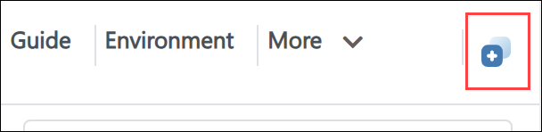
 
## Managing Your Virtual Machine
 
Feel free to **Start, Stop, or Restart (2)** your virtual machine as needed from the **Resources (1)** tab. Your experience is in your hands!

- Under **Actions** select the **third option from left** to Stop or Deallocate the vm when you finish your work.

    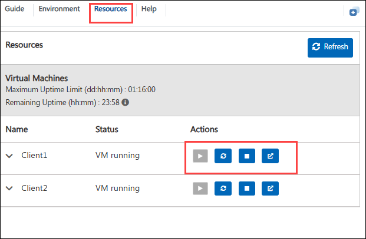

- If the **VM remains idle for 15 minutes**, it will **automatically deallocate (1)** to save time. You can launch it again by navigating to **Actions (2) > start** and clicking the **Start** button from **Environment Status (3)**

    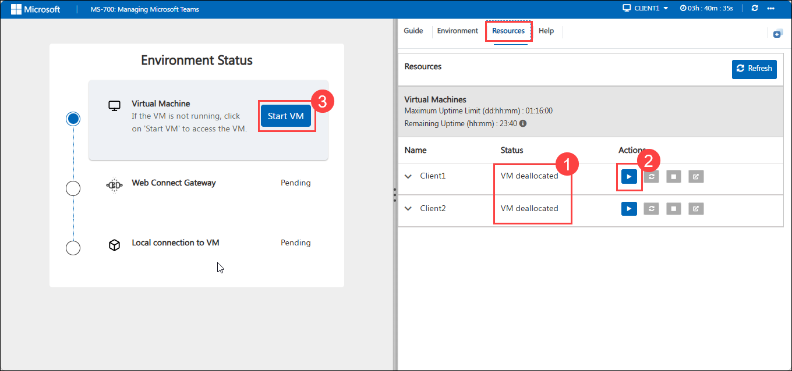

## Let's Get Started with VM 

The lab environments have been specifically designed in this manner to give you experience managing Microsoft Teams in a Microsoft 365 deployment. You will be provided with two virtual machines and a Microsoft 365 tenant to complete the lab steps.

### 1. Sign in to the lab virtual machines

The labs in this course will use two virtual machines:

- **Client 1 VM:** a stand-alone Windows 11 client virtual machine with Microsoft Teams pre-installed.

- **Client 2 VM:** a stand-alone Windows 11 client virtual machine with Microsoft Teams pre-installed.

    

    You can **switch between two Virtual Machines** from the highlight dropdown option.

    >**Note:** Once you get connected to the Lab environment, The VM on the left side of the Lab interface will launch the Windows 11 Welcome experience, Follow the below steps to skip through the welcome wizard.

- By default you will be connected to **Client 1 VM**. 

- Select **NO** and Click **ACCEPT**.

	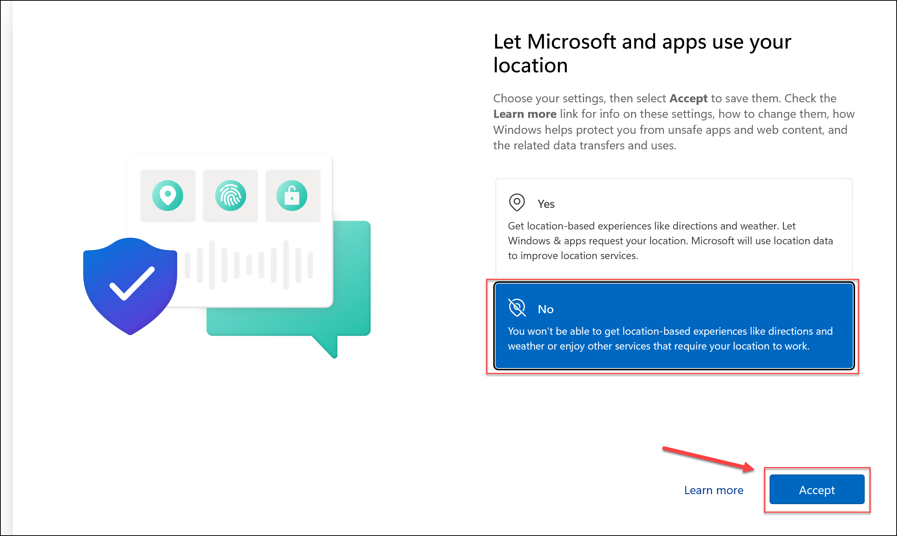

- Select **NO** and Click **ACCEPT**.

	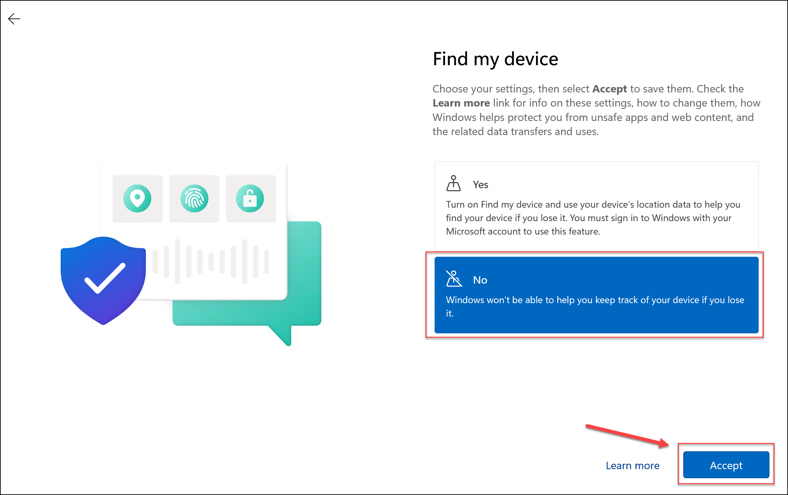

- Select **Required only** and Click **ACCEPT**.

	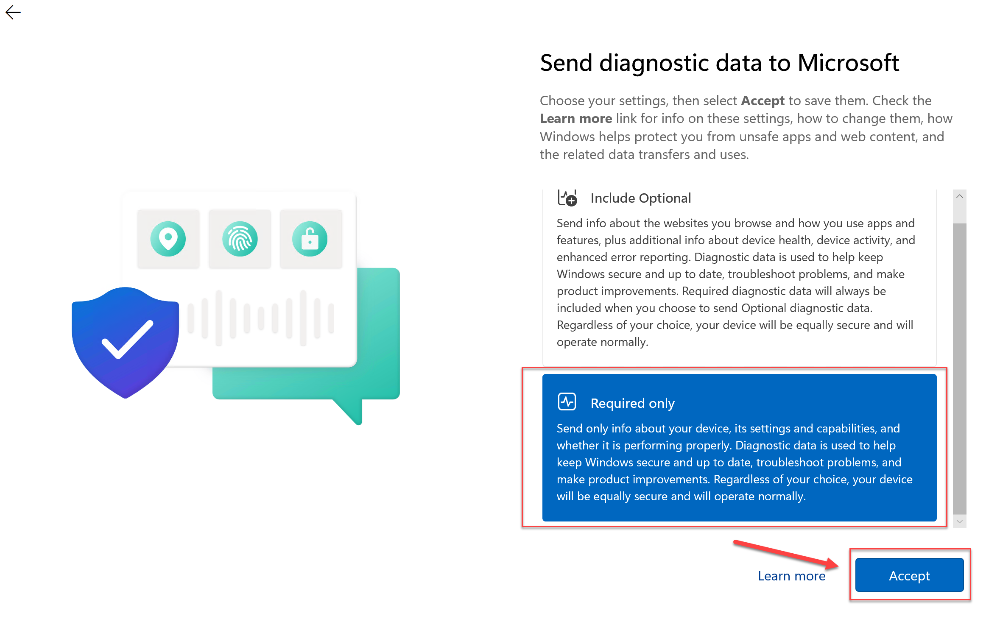

- Select **NO** and Click **ACCEPT**.

	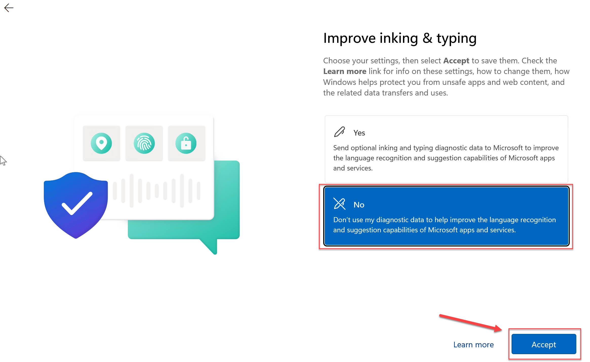

- Select **NO** and Click **ACCEPT**.
  
	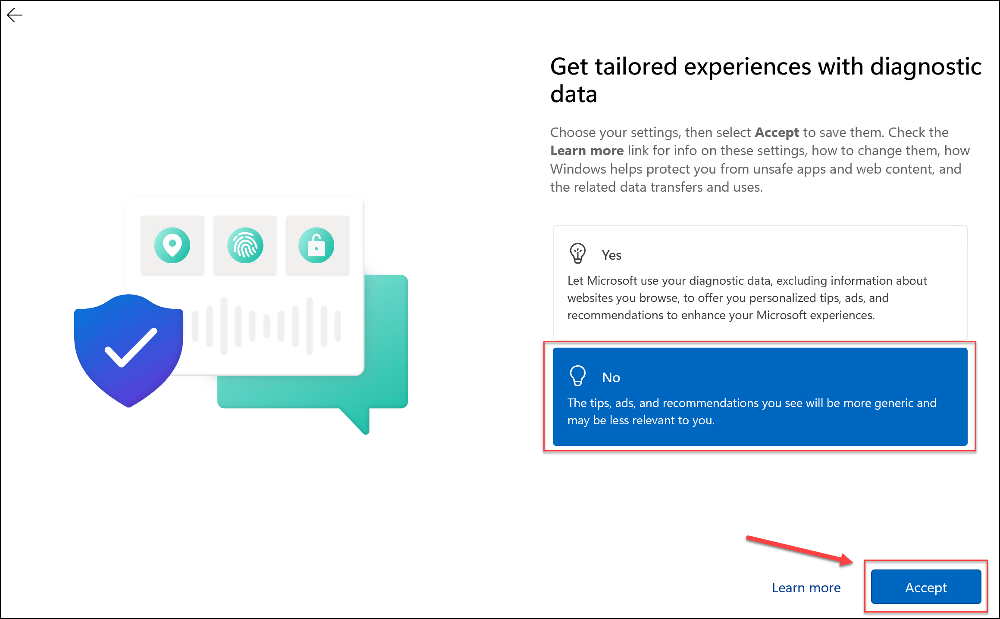

- Select **NO** and Click **ACCEPT**.

	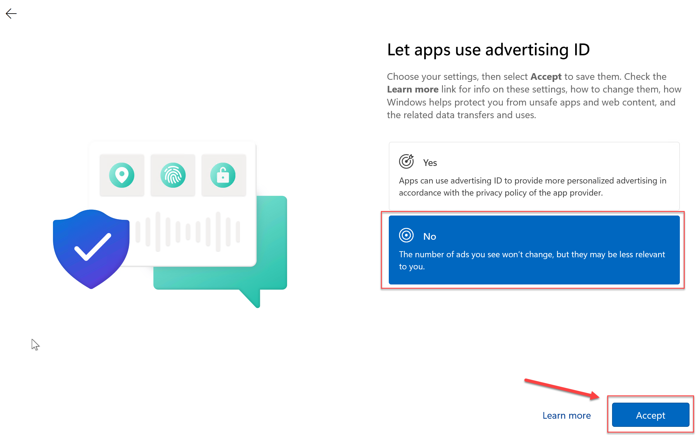

    >>**Note:** You can connect to either of the Virtual Machines by switching to it from your Lab Interface. Please refer to below Screenshot. By Default, you will connect to **Client1**

    

    >>**Note:** **Perform the same steps as above to skip through the welcome wizard on Client2**

### 2. Review installed applications

Once you sign in to the VM, Just search for **TEAMS (1)** from the search bar available on the taskbar, and verify following applications have been installed:

- **Microsoft Teams**

	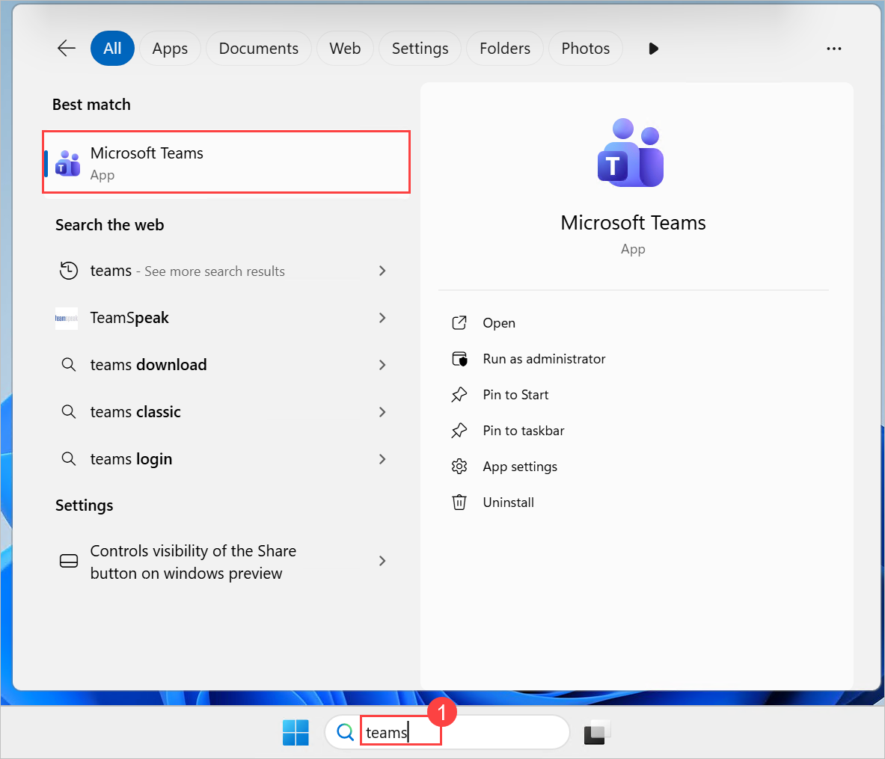

### 3. Review Microsoft 365 tenant

Besides two VMs, you will also be provided with a Microsoft 365 tenant with the following highlights:

- **Office 365 E5** with **Teams Enterprise Licenses**.

- **Microsoft Teams Phone Standard** for Resource accounts and **Microsoft Teams Rooms pro** licenses 

- One **Global Administrator (ODL User)** and few standard users have been pre-created.

- The username of the Global Administrator is **<inject key="AzureAdUserEmail"></inject>**

- **<inject key="TenantDomainName"></inject>** - This is the domain associated with the Microsoft 365 tenant that was provided by CloudLabs.

    >**Note:** All the information related to the Lab Environment is available on the **Environment** tab of the Lab Interface.

    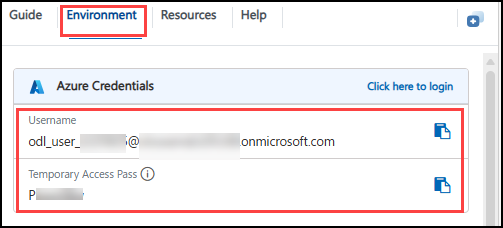
 
## Support Contact
 
The CloudLabs support team is available 24/7, 365 days a year, via email and live chat to ensure seamless assistance at any time. We offer dedicated support channels tailored specifically for both learners and instructors, ensuring that all your needs are promptly and efficiently addressed.
 
Learner Support Contacts:
 
- Email Support: [cloudlabs-support@spektrasystems.com](mailto:cloudlabs-support@spektrasystems.com)
- Live Chat Support: https://cloudlabs.ai/labs-support
 
Click **Next >>** from the bottom right corner to embark on your Lab journey!
 

 
Now you're all set to explore the powerful world of technology. Feel free to reach out if you have any questions along the way. Enjoy your workshop!
