# Lab 01: Manage collaboration and communiction with Microsoft Teams

## Estimated Duration: 120 Minutes

## Microsoft 365 user interface

Given the dynamic nature of Microsoft cloud tools, you may experience user interface (UI) changes that were made following the development of this training content. This will manifest itself in UI changes that do not match up with the detailed instructions presented in this lab manual.

The CloudLabs team will update this training course as soon as any such changes are brought to our attention. However, given the dynamic nature of cloud updates, you may run into UI changes before this training content is updated. **If this occurs, you will have to adapt to the changes and work through them in the lab exercises as needed.**

## Lab Scenario

In the labs, of this course, you will assume the role of Joni Sherman, a Teams Administrator. You are asked to ensure the required Teams admin roles are assigned to your pilot team members and check license assignment to users. As part of the Microsoft Teams rollout in M365 Organization, you need to make sure the pilot team members are well versed with the usage of Teams admin center, its menus and PowerShell cmdlets to handle day to day administrative tasks. You have implemented Microsoft 365 in a virtualized lab environment already and were commissioned to test the creation Microsoft 365 Groups from the M365 admin center and new teams using Teams desktop and web clients. You will also enable access to explore Teams Preview features using Teams update policy. Once the pilot team completes exploring and testing the features in Teams admin center and Microsoft 365 admin center, you need to guide them to follow best practices in creating and configuring naming and expiration policies for the groups and teams while enforcing the restriction on the creation of teams. 

You have just started the pilot project, and you’ve already got two virtual machines with preinstalled Teams Desktop clients and a tenant with different users:

- Joni Sherman **<inject key="JoniSherman" enableCopy="true" style="color:blue" />** **Teams administrator**

- Patti Fernandez **<inject key="PattiFernandez" enableCopy="true" style="color:blue" />** **Teams device administrator**

- Allan Deyoung **<inject key="AllanDeyoung" enableCopy="true" style="color:blue" />** **Teams communication support engineer**

- Alex Wilber **<inject key="AlexWilber" enableCopy="true" style="color:blue" />** **Regular pilot user from Canada**

- Lynne Robbins **<inject key="LynneRobbins" enableCopy="true" style="color:blue" />** **Regular pilot user**

- Diego Siciliani **<inject key="DiegoSiciliani" enableCopy="true" style="color:blue" />** **Regular pilot user**

## Objectives

After you complete this lab, you will be able to:

- Assign Teams admin roles to users

- Check license assignment for users

- Understand the Teams admin center and its menus

- Install the Teams PowerShell module and explore its cmdlets

- Create Microsoft 365 Groups from the M365 admin center

- Create new teams using the Teams desktop client

- Create new teams using the Teams web client

- Configure expiration policies

- Restrict creation of new teams to members of a security group

- Create naming policies

- Enable access to Teams Preview features

## Lab Setup

- Estimated Time: 100 minutes.

## Instructions

### Exercise 1: Prepare Teams admin roles and licenses

In the first exercise, you will assign required administrative roles to users and check license assignments for the Teams license. To perform these tasks, you will use default tenant global admin.

#### Task 1 - Assign Teams admin roles to users

In this task, you will use the default global admin to sign in to the Microsoft 365 admin center and assign several Teams admin roles to different users. This task is crucial for later tasks and exercises as you will perform most of the tasks in the context of Joni Sherman’s account.

1. Browse to Microsoft 365 admin center (https://admin.microsoft.com/).

	- Ensure that you are connected to the **Client1** VM.
	
		>>**Note:** You can connect to **Client1** VM by switching to it from your Lab Interface. Please refer to below Screenshot. By Default, you will connect to **Client1** VM.
	
		

	- Open **Microsoft Edge (1)** on **Client1** VM.
	- Browse to the **Microsoft 365 admin center (2)** at [**https://admin.microsoft.com/**](https://admin.microsoft.com/).

		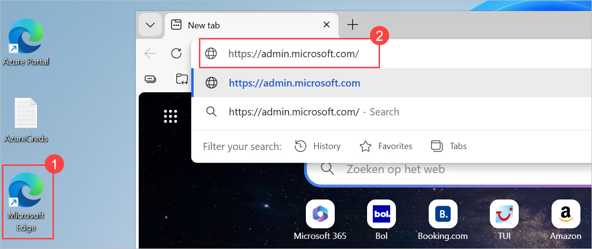

	- Enter the **Global Admin User Name (1)** and click on **Next (2)**:
		**<inject key="AzureAdUserEmail"></inject>** `← 📋 Copy`

		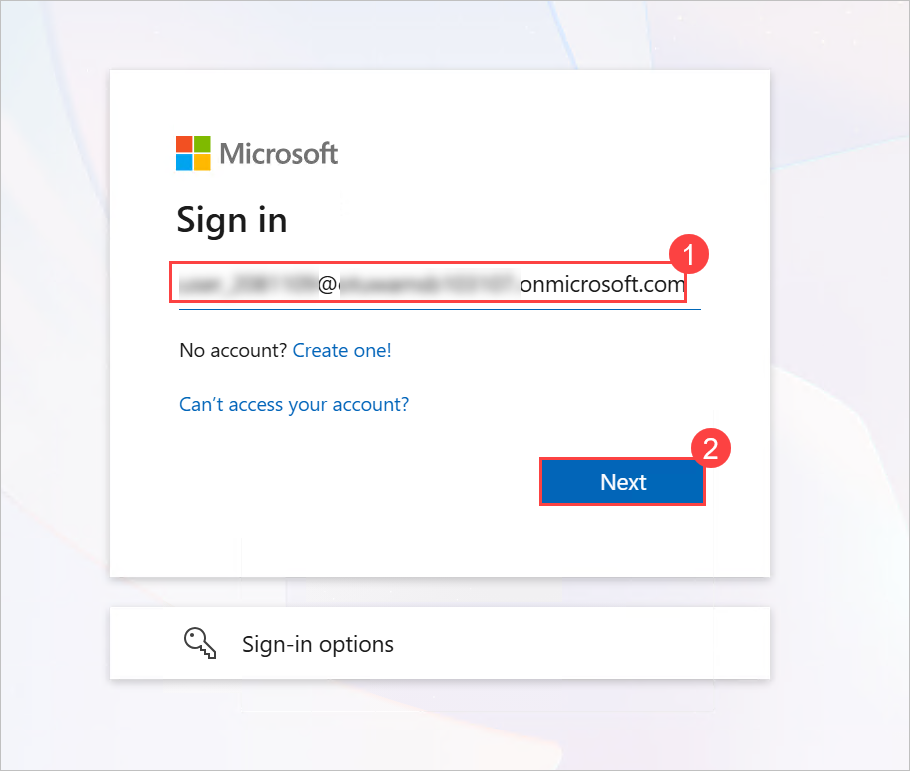

	- Enter the **Temporary Admin Password (3)** and click on **Sign in (4)**:
		**<inject key="AzureAdUserPassword"></inject>** `← 📋 Copy`

		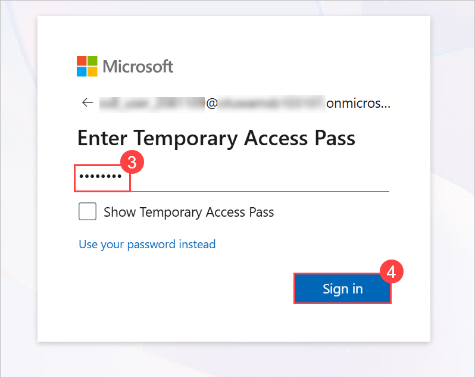
	
	- Once you **SignIn**, Microsoft will ask if you would to **Stay signed in?**, Click on **No**

		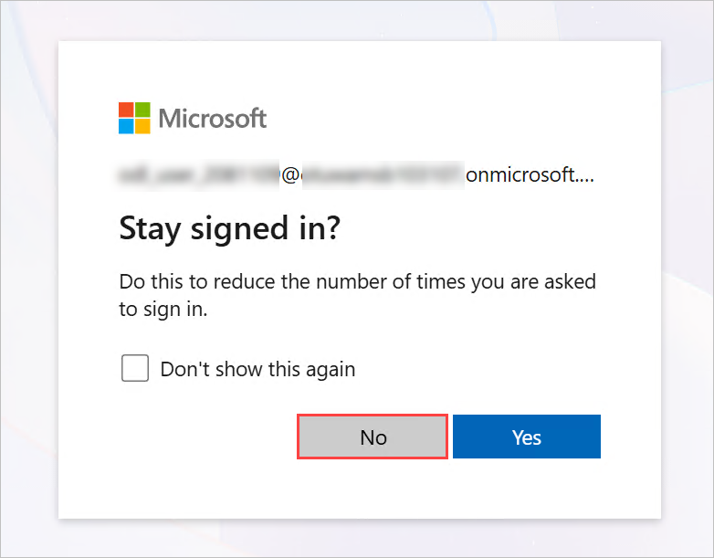

2. To assign **Teams admin** role to **Joni Sherman**

	- Select the navigation menu in the upper-left and select **Users** and **Active users** from below it.

		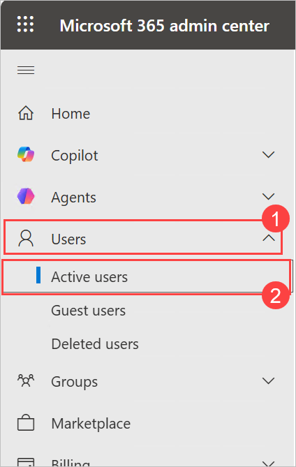

	- In the Active user’s list, search (1) and select **Joni Sherman**, to open the right-side settings pane.

		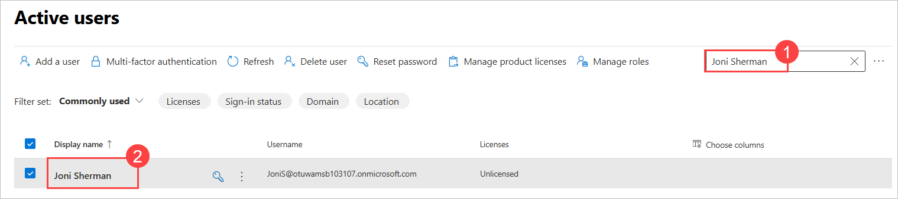

	- Before proceeding with role assignments, please ensure that all users have the required licenses assigned. kindly assign **Microsoft Teams Enterprise** and **Office 365 E5 (No Teams)** licenses to the respective users before continuing with the role assignment process.

		- Add licenses **Microsoft Teams Enterprise** and **Office 365 E5 (No Teams)** to below users:
			- Joni Sherman 
			- Alex Wilber 
			- Patti Fernandez
			- Allan Deyoung
			- Lynne Robbins
			- Diego Siciliani

				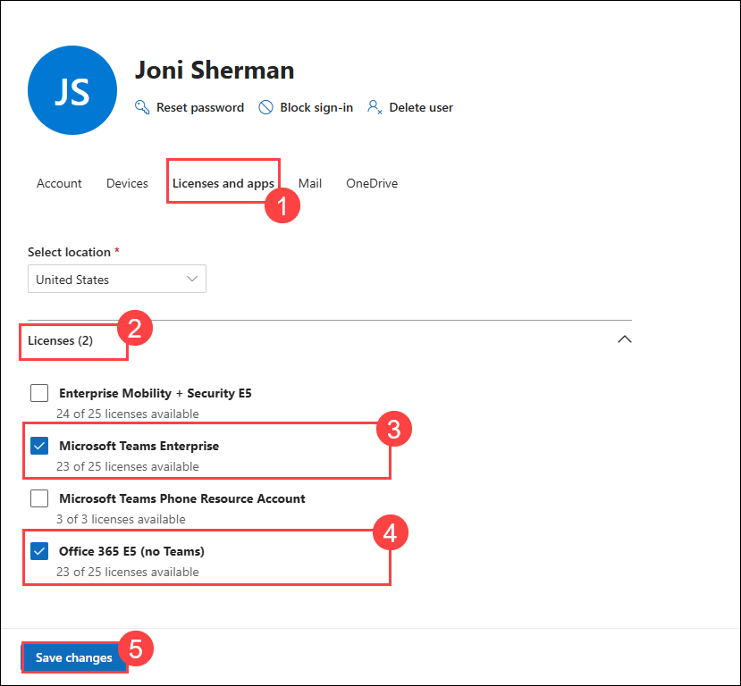

			- Repeat this process for all users 

	- In the settings below the Account tab, select **Manage roles**.

		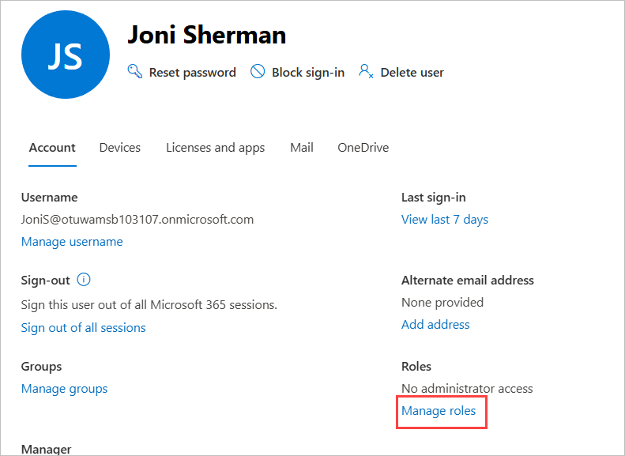

	- On the **Manage admin roles** pane, select **Admin center access** and scroll down to expand **Show all by category** to reveal all available roles.

	- Select **Teams Administrator (1)** checkbox then select **Save changes (2)**. You will see the message **Admin roles updated** on the upper part of the pane to confirm the update. Close the **Manage admin roles** pane by selecting the X button on the top right side of the pane.

		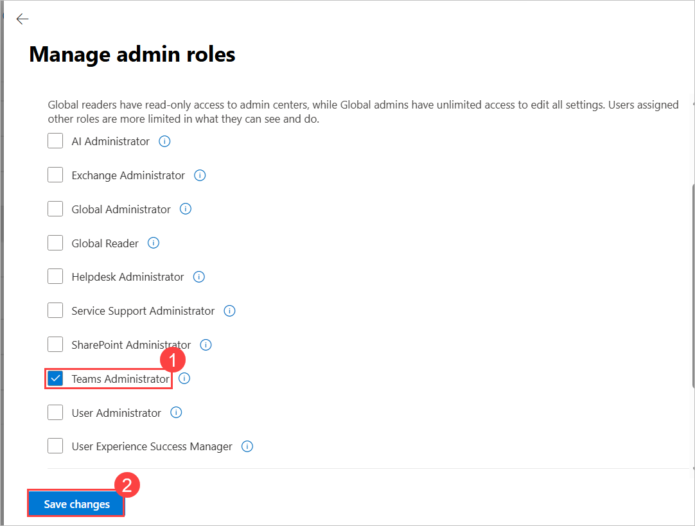

3. To assign **Teams device admin** role to **Patti Fernandez**

	- Repeat the same steps as above, in the **Active users list**, search and select **Patti Fernandez** and assign **Teams Device Administrator** role to **Patti Fernandez**.

		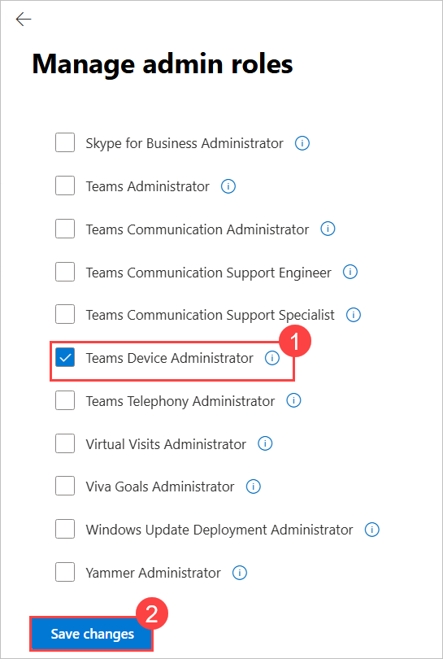

4. To assign **Teams communication Support engineer** role to **Allan Deyoung**

	- Repeat the same steps as above and assign **Teams communication support engineer** role to **Allan Deyoung**.

		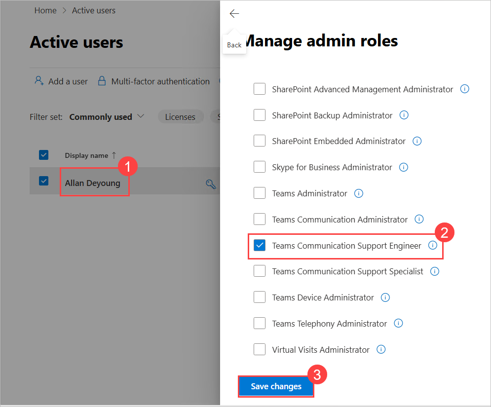

You have now successfully assigned the Teams admin roles.

- Teams Administrator: Joni Sherman

- Teams Device Administrator: Patti Fernandez

- Teams communication support engineer: Allan Deyoung

Proceed to the next task.

#### **Task 2 – Check license assignment of your users**

In this task, you will check the license assignment of all users participating in the pilot. At the end of the task, you will confirm that all pilot users are licensed correctly and Alex Wilber’s location is updated to Canada as preparation for a later task.

1. Connect to the **Client 1 VM** and browse to Microsoft 365 admin center (https://admin.microsoft.com/) as **ODL User** <inject key="AzureAdUserEmail" enableCopy="true"/>
and **password:** <inject key="AzureAdUserPassword" enableCopy="true"/>

2. Update **Alex Wilber’s** location to **Canada**

	- On the **Users** > **Active users (1)** page, select the name of **Alex Wilber (2)**.

	- Select **Licenses and Apps (3)** tab.

	- Select the dropdown menu under **Select location**, and update to **Canada (4)**.

	- Select **Save changes (5)**.

		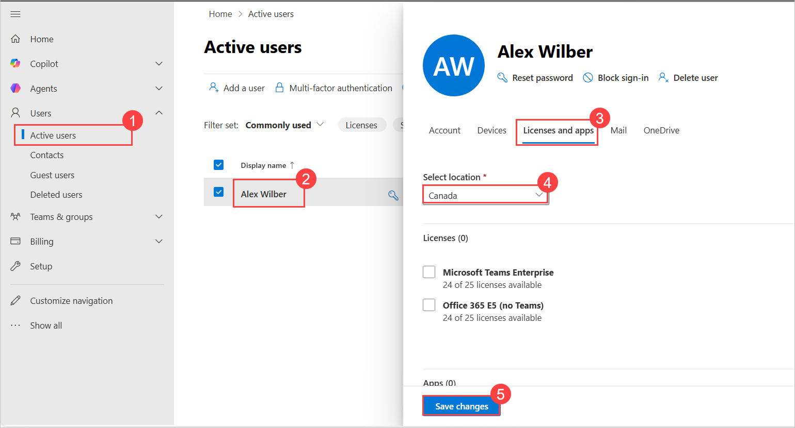

3. Check **Alex Wilber’s** licenses

	- On the same tab, under **Licenses** section, verify that **Office 365 E5** and **Microsoft Teams Enterprise** is selected.

		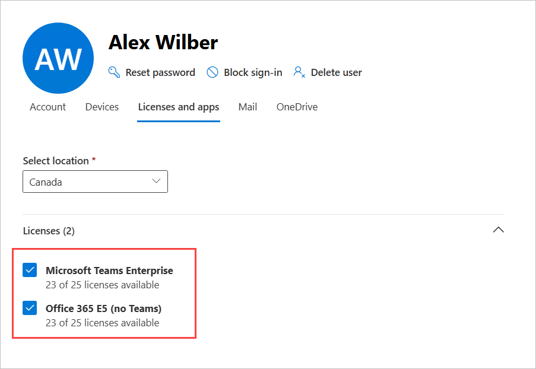

	- Select **Apps** to expand All licenses.

	- Scroll down the list of all apps, and verify **Microsoft Teams** is selected.

		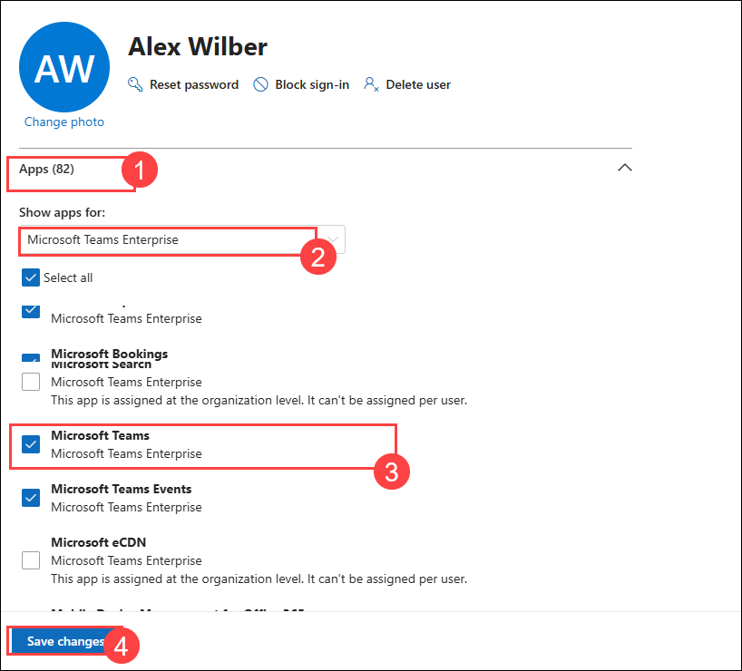

4. You can repeat the same steps to check other users’ licenses. Do not change their locations. Please ensure that all users have the required licenses assigned. If not kindly assign **Microsoft Teams Enterprise** and **Office 365 E5 (No Teams)** to users.

You have successfully validated that all Users participating in the pilot own Teams licenses and are ready to start working with Teams. You have also changed the location of Alex Wilber to Canada, as a preparation for a later task. Continue with the next task.

You have finished the first exercise, and you can continue with the next one.

### **Exercise 2: Explore Teams management tools**

In this exercise, you will explore the Teams admin center and install the Teams PowerShell module, required to manage teams, policy packages, calling features, and all other settings for Teams in your tenant. You can perform most of the tasks possible from the Teams admin center and the PowerShell. You can create scripts for automation and even access several settings not available in the GUI.

To perform these tasks, you will use **Joni Sherman’s account** **<inject key="JoniSherman" enableCopy="true" style="color:blue" />** and navigate to **environment tab** to get password.
#### **Task 1 - Explore Teams admin center**

You will review the available settings for managing Teams in the Teams admin center.

1. Connect to the **Client 1 VM** and browse to Teams admin center (https://admin.teams.microsoft.com) as **Joni Sherman** **<inject key="JoniSherman" enableCopy="true" style="color:blue" />** and  navigate to **environment tab** to get password.

	>**Note:** You can use **InPrivate window** of Microsoft Edge for logging in with different credentials.

2. In left navigation of the Teams admin center, select **Teams (1)** > **Manage teams (2)**. You will see the teams in your organization once created.

	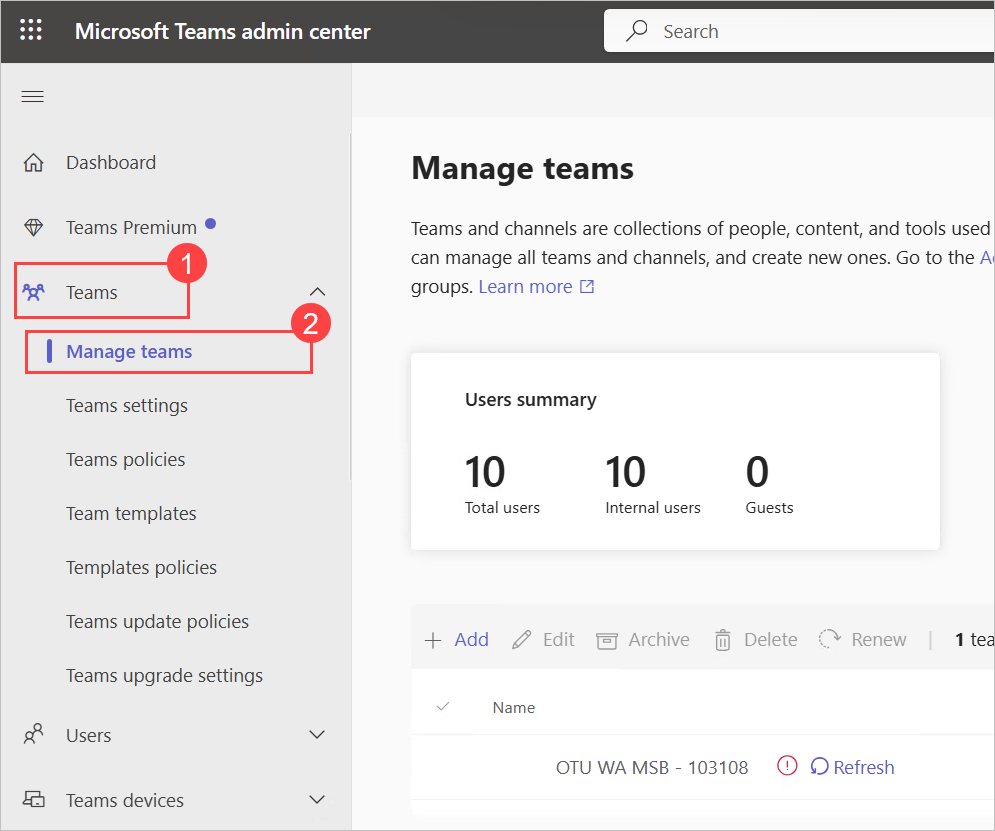

3. In left navigation of the Teams admin center, select **Teams (1)** > **Teams policies (2)**. You can see the default Teams policy named **Global (Org-wide default) (3)**.

	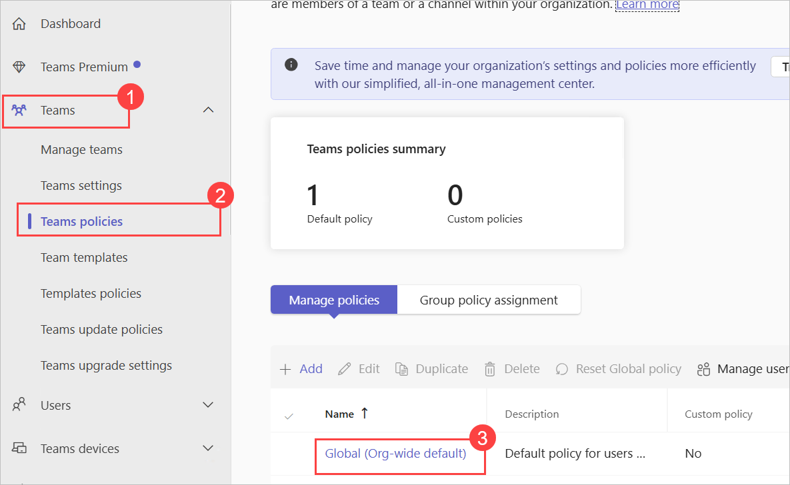

	You can explore other settings to familiarize various controls in the Teams admin center.

You have successfully explored several available menus from the Teams admin center for managing teams and configuring policies in your tenant.

#### **Task 2 - Install and explore Teams PowerShell module**

In this task, you will install and connect with the Teams PowerShell module to your tenant and explore the available cmdlets and functions to manage your tenant. You can install the Teams PowerShell module from the available repositories preconfigured in your Windows 10 operating system and do not need to download any executables via the browser.

**Please note:** Microsoft PowerShell is soon to be deprecated and Microsoft Graph PowerShell will now be used. Therefore, both PowerShell and Microsoft Graph PowerShell commands are provided to complete this task. Users will be able to use either the PowerShell or Microsoft Graph PowerShell commands. Once PowerShell has been deprecated, please switch to using the Microsoft Graph PowerShell commands. 

The Microsoft Graph PowerShell commands for this task are provided after the Microsoft PowerShell commands.

1. Connect to the **Client 1 VM**.

2. Open **Windows PowerShell (1)** and **run as Administrator (2)**.

	- Select **Start** and search for **Windows PowerShell (Admin)**, then right select **Run as administrator**. 

		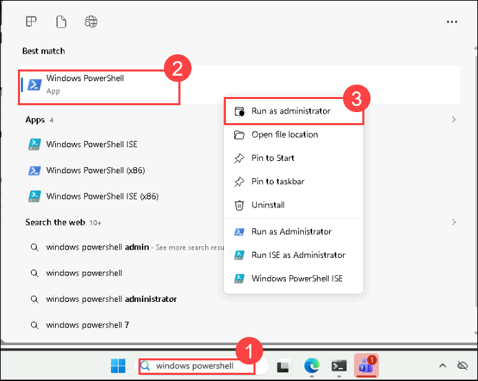

3. Install **Microsoft Teams PowerShell module**

	- In the PowerShell window, enter the following cmdlet and press **Enter:**

		- Microsoft PowerShell: 
			```PowerShell
			Install-Module -Name MicrosoftTeams
			```
		- Microsoft Graph PowerShell:
			```PowerShell 
			Install-Module -Name Microsoft.Graph
			```
			```PowerShell 
			Install-Module -Name Microsoft.Graph.Beta
			```

	- Enter **Y** and press **Enter** twice to confirm the installation of the NuGet provider and Untrusted repository.

4. Connect to your tenant.

	- Enter the following cmdlet in the PowerShell window and press **Enter**:
		
		```PowerShell 
		Connect-MicrosoftTeams
		```
		Microsoft Graph PowerShell:

		```PowerShell
		Connect-MgGraph 
		```

	- In the Sign-in window, sign in as the Teams admin 

		>**Note**: When **connecting via Microsoft Graph,** the sign-in page shown in the image below will appear. Select **Work or school account**, click **Continue**, and then complete the sign-in process.".

		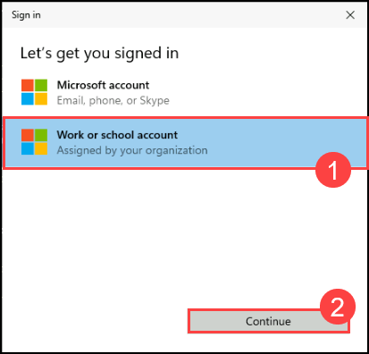

		- Sign in using Joni Sherman - **<inject key="JoniSherman" enableCopy="true" style="color:blue" />** 

			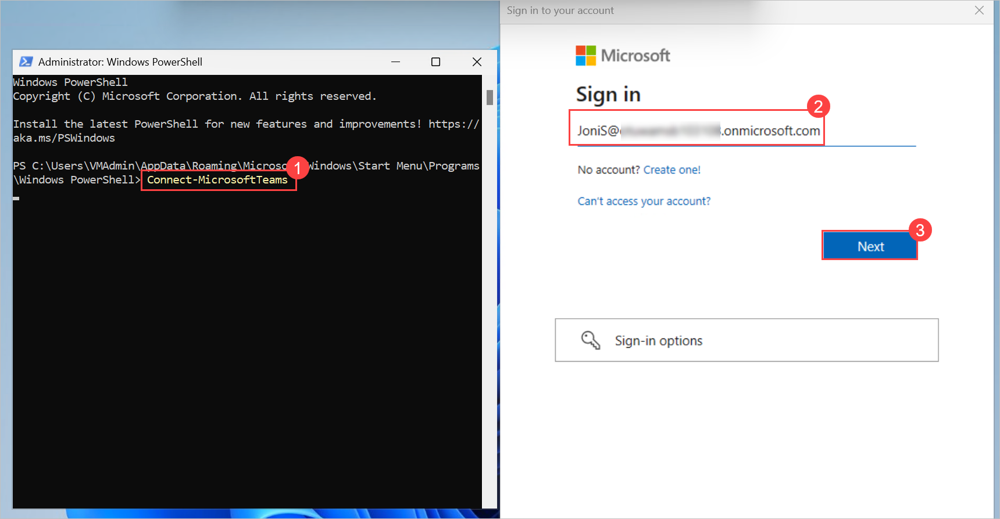 

		- Enter the password - navigate to **environment tab** to get password.

			

		- Once you **SignIn**, Microsoft will ask if you would to **Stay signed in?**, Click on **No**

			

	- When the sign-in was successful, several information about the signed-in user and the tenant are displayed.

		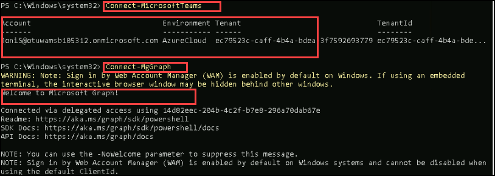

5. Explore **Microsoft Teams PowerShell module**

	- To confirm the MicrosoftTeams module is loaded correctly, enter the following cmdlet and press **Enter** to view all available PowerShell modules:

		- Microsoft PowerShell - ```Get-Module```
		-Microsoft Graph PowerShell - ```Get-Module -Name Microsoft.Graph -ListAvailable``` or ```Get-Module -Name MicrosoftTeams```

			>**Note**: To the left of the **Name** column, the version of the PowerShell module is displayed.

			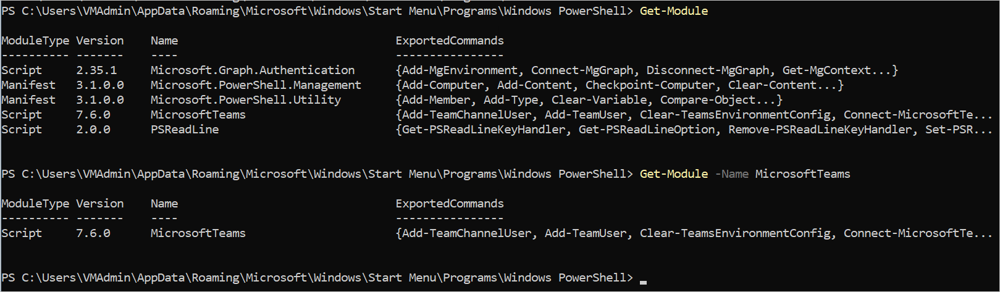

	- To get an overview of the available Teams PowerShell cmdlets from the MicrosoftTeams module, enter the following cmdlet and then press **Enter**:

		- Microsoft PowerShell - ```Get-Command -Module MicrosoftTeams```

			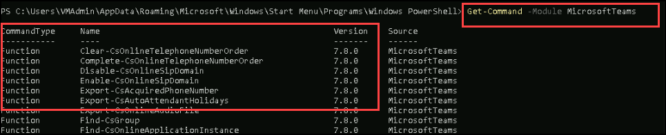

   		- Microsoft Graph PowerShell - ```Get-Command -Module Microsoft.Graph.Teams```

	- The Get-Help cmdlet is used to explore the available cmdlets. For example, to get more information about how to create a team with PowerShell, enter the following cmdlet and press **Enter**:

		-  ```Get-Help New-Team```

			>**Note**: If you receive a message to update the help libraries, type **Y** for yes.

	- Disconnect from the Microsoft Teams environment.

		- Microsoft PowerShell - ```Disconnect-MicrosoftTeams```
		-Microsoft Graph PowerShell - ```Disconnect-MgGraph```

			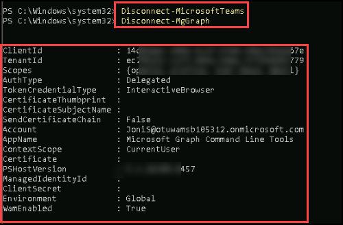

6. Close the PowerShell window and continue to the next task.

You have successfully used the Microsoft Teams PowerShell module to connect to Teams and explored available cmdlets.

### **Exercise 3: Create groups and teams**

In this exercise, you will create a Microsoft 365 group from the Microsoft 365 admin center and create a team from the Teams desktop client and the web client.

#### **Task 1 - Create a Microsoft 365 Group**

You will create a new Microsoft 365 Group named “IT-Department,” and then add the pilot members serving as a basis for your future teams and licensing.

1. Connect to the **Client 1 VM** and browse to the **Microsoft 365 admin center** (https://admin.microsoft.com/) as **Joni Sherman** **<inject key="JoniSherman" enableCopy="true" style="color:blue" />** and  navigate to **environment tab** to get password. 

2. In the Microsoft 365 admin center, select **Teams &amp; groups (1)** > **Active teams &amp; groups (2)**.

3. On the **Active teams and groups** page, select **+ Add a Microsoft 365 group (3)**.

	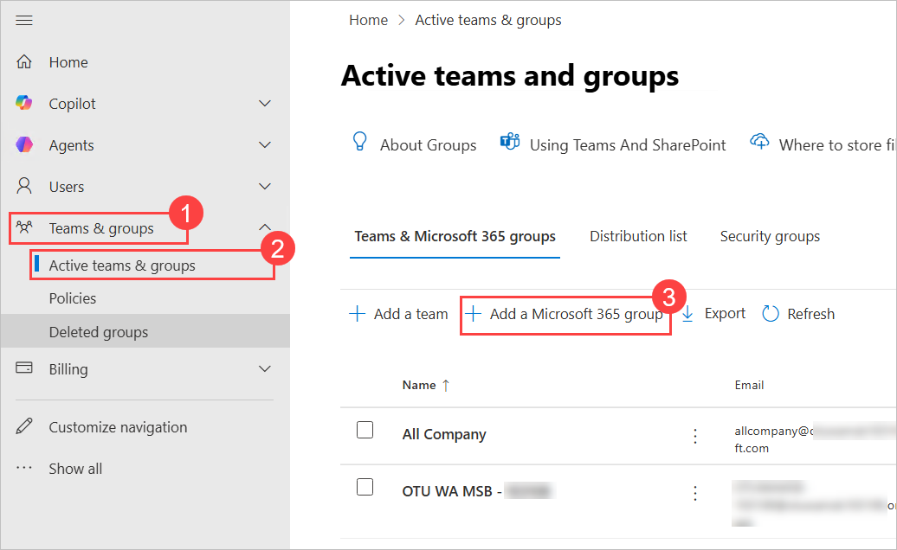

4. Follow the **Add a group** wizard with the following information:

	- **Basics:**

		- Name: **IT-Department**
		- Descrption: **All staff of the IT-Department**
		- Select **Next**

	- **Owners:**

		- Select **+ Assign owners (1)**
		- Search and select **Joni Sherman (2)(3)**
		- Select **Add(1) (4)**, and then select **Next (5)**.

			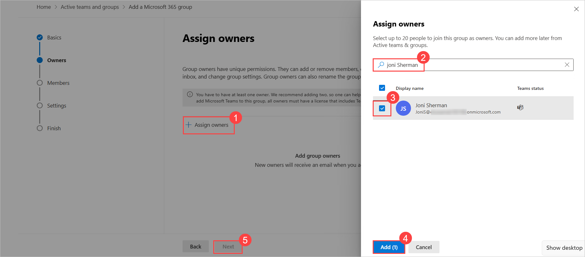

	- **Members:**

		- Select **+ Add Members**, and add the following users:
			- Patti Fernandez
			- Allan Deyoung
			- Admit Malik
		- Select **Add(3)**, and then select **Next**.

	- **Settings:**

		- Enter **IT-Department** for Group email address.
		- Privacy: **Private**
		- Uncheck **Create a team for this group**.
		- Select **Next**

			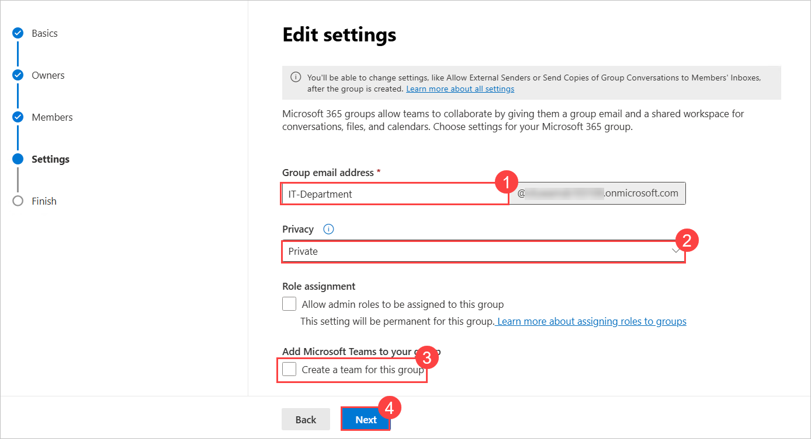

5. Press the **Create Group** button, then press **Close**.
   
6. Wait a moment and select **Refresh** until the group is visible. You will see there is no Teams icon in the **Teams status** column.

7. Select the **IT-Department** group to review the settings and members.

The new Microsoft 365 Group with the name “IT-Department” was successfully created. Close the browser window and continue to the next task.

#### **Task 2 - Create a new team by using the desktop client**

To test the self-service capabilities of Teams, in this task, **Alex Wilber** will sign in to the Teams Desktop client, create a new team with the name **Teams Rollout** and add all members participating in the Teams evaluation project.

1. Connect to the **Client 2 VM** by switching the VM from the header VM dropdown.

	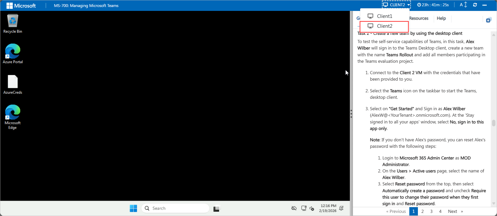

2. Select the **Microsoft Teams** icon on the taskbar to start the Teams, desktop client.

3. Select on **"Get Started"** and Sign in as **Alex Wilber** **<inject key="AlexWilber" enableCopy="true" style="color:blue" />** and  navigate to **environment tab** to get password. At the ‘Stay signed in to all your apps’ window, select **No, sign in to this app only**.

	>**Note**: If you don’t have Alex's password, you can reset Alex's password with the following steps:
	
	1. Login to **Microsoft 365 Admin Center** (https://admin.microsoft.com/) as **ODL User** <inject key="AzureAdUserEmail" enableCopy="true"/>
and **password:** <inject key="AzureAdUserPassword" enableCopy="true"/>. 

	2. On the **Users &gt; Active users** page, select the name of **Alex Wilber**. 

		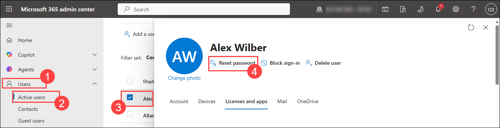

	3. Select **Reset password** from the top, then select **Automatically create a password** and uncheck **Require this user to change their password when they first sign in** and **Reset password**.

		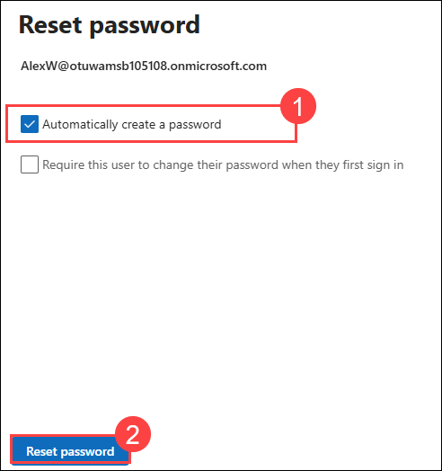 

		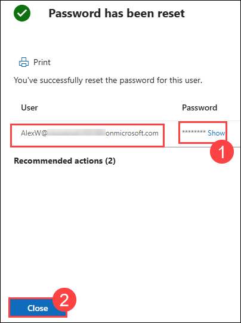

	4. Use the password under column Password to login.

		>**Note**: You might need to download and install the latest Teams, desktop client. If so, select **Update Teams** and follow the installation guideline - Select **Download for desktop** > **Download Teams** **Run**.

4. In the Teams desktop client, select **Chat** from the left menu.

5. Select **... (3)** dots right to **Teams and channels (2)** and select **Your teams and channels (4)**.

	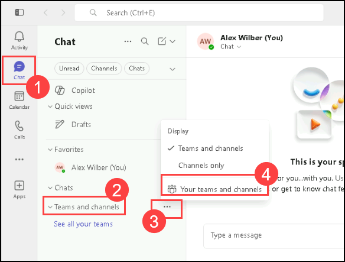

1.  Click on **Create team dropdown (1)** and select **Create team (2)**.

	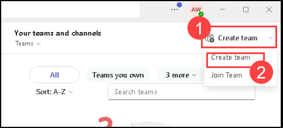

6. Select **Create team > From Scratch** > Enter the team name ``Teams Rollout`` **(1)** > Enter anything you want for **Description (2)** > Set Team type to **Public (3)** > Type ``Teams Rollout`` **(4)** for Name the first channel. Select **Create (5)**.

	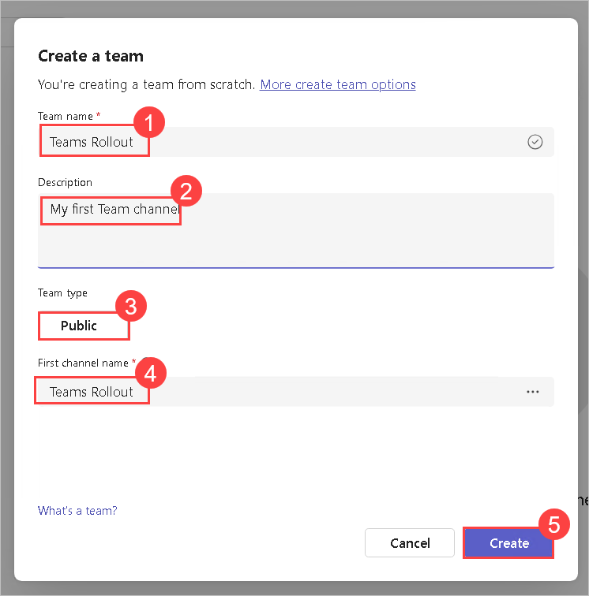

7. On the **Add members to Teams Rollout (1)** window, enter the following names and select **Add (2)**.

	- Joni Sherman
	- Lynne Robbins
	- Diego Siciliani

		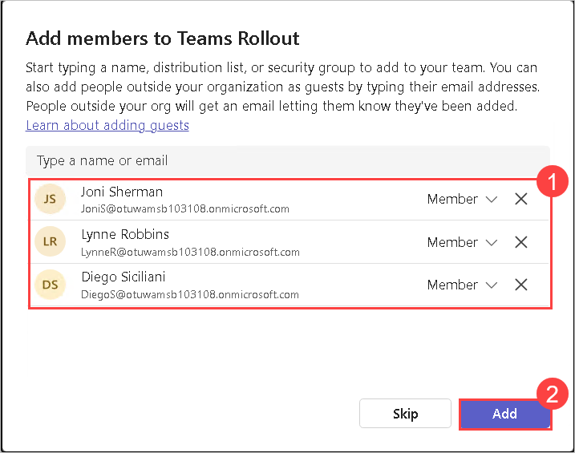

8. Select **Teams** from left and corner and click the **...** button next to **Teams Rollout** > **Manage Team**.

8. Select the dropdown menu next to **Joni Sherman** and switch from **Member** to **Owner**.

	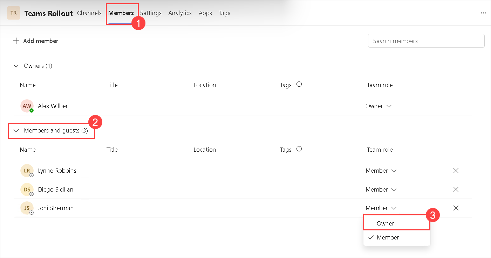

9. Select **Close**.

You have successfully created a new team from the Teams desktop client added the project team members, and you have made Joni Sherman a team owner.

#### **Task 3 - Create a new team by using the web client**

In this task, **Lynne Robbins** will continue testing the self-service capabilities of Teams by using the Teams web client to create another team with the name **Sales**. She will also add **Alex Wilber** as a member.

1. Connect to the **Client 2 VM** by switching the VM from the header VM dropdown.

	

2. Browse to the **Microsoft Teams web client** at [**https://teams.microsoft.com**](https://teams.microsoft.com/) and sign in as **Lynne Robbins** **<inject key="LynneRobbins" enableCopy="true" style="color:blue" />**  navigate to **environment tab** to get password.

3. Select **Use the Web app instead** if prompted to download the Teams Desktop app. At the ‘Stay signed in to all your apps’ window, select **No, sign in to this app only**.

4. In the left navigation pane, select the ellipsis (…) next to **Teams and channels** or **See all your teams** , and then select **Your teams and channels** and click on **Create team** on top right-corner, select **Create team**

	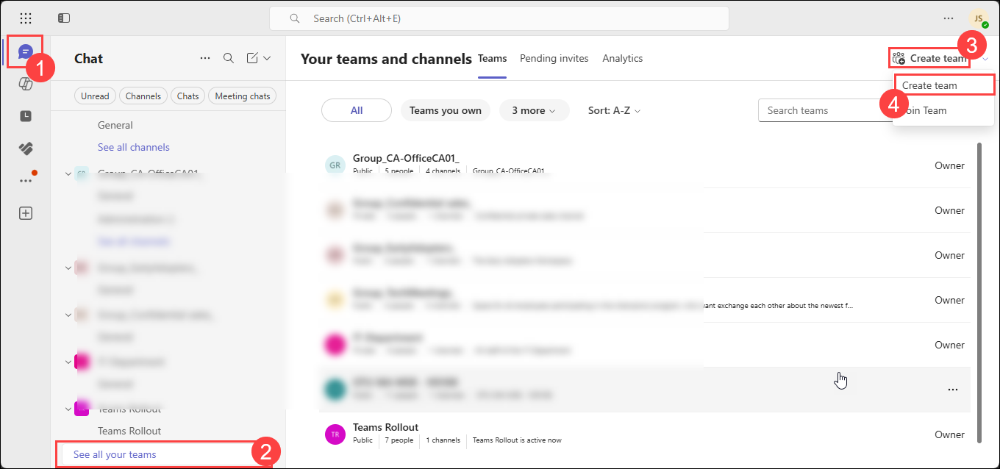

5. Select + at the top left > **Create team** >Enter the team name **Sales** > Enter anything you want for **Description** > Select Team type to **Private** > Enter **Sales** in Name the first channel. Select **Create**.

	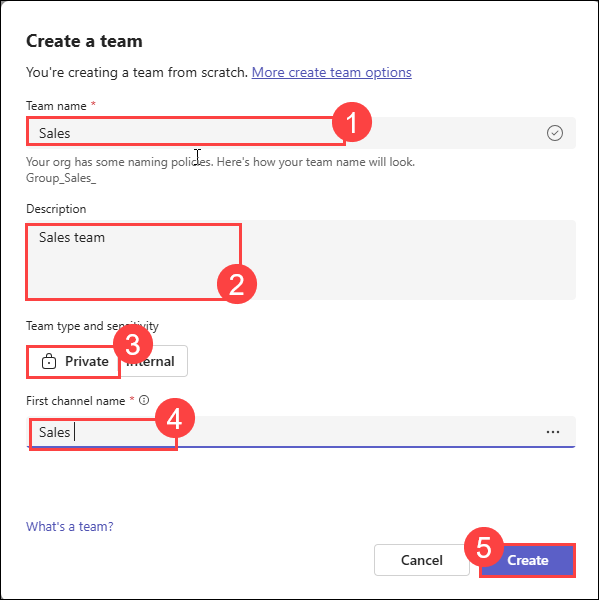

6. On the **Add members to Sales** window, enter the following names and select **Add** > **Close**.

	- Alex Wilber

The newly created team is displayed in the list of your teams. You have successfully created a new team with the Teams web client.

### Exercise 4: Implement lifecycle management and governance for Microsoft Teams

Your organization has started the planning process for Microsoft 365 services adoption. You are assigned a Teams admin role to plan Teams governance. Since Teams relies on Microsoft 365 groups, you need to plan governance procedures for Microsoft 365 groups, including creating **Microsoft 365 groups expiration policies**, configuring **Microsoft 365 Group creation policy permissions**, configuring and testing **Microsoft 365 Groups naming policies**.

#### **Task 1 - Create and assign an expiration policy**

Based on the organization’s requirement, unneeded groups should be deleted automatically after 90 days. To evaluate the expiration feature for Teams, you will configure a group expiration policy that will expire the **Teams Rollout** group after 90 days.

1. Connect to the Client1 VM and browse to Entra admin center (https://entra.microsoft.com/) as **ODL User** <inject key="AzureAdUserEmail" enableCopy="true"/>
and **password:** <inject key="AzureAdUserPassword" enableCopy="true"/>

2. On the left navigation pane, select **Entra ID (1)** > **Groups (2)** > **All groups (3)**.

3. On the **Groups | All groups** page, select **Expiration (4)**.

	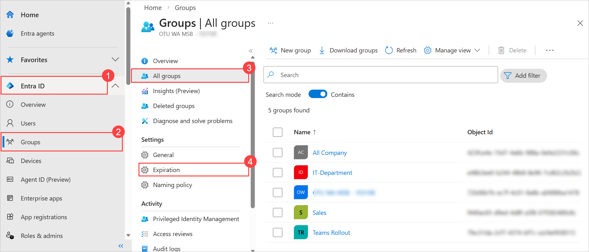

4. On the **Groups | Expiration** page, configure the following settings:

	- In the dropdown menu of **Group lifetime (in days)**, select **Custom** and enter **90** to the text box.

	- In the text box right from **Email contact for groups with no owners**, enter **<inject key="JoniSherman" enableCopy="true" style="color:blue" />** and  navigate to **environment tab** to get password.

	- Right from **Enable expiration for the Office 365 groups**, select **Selected**.

		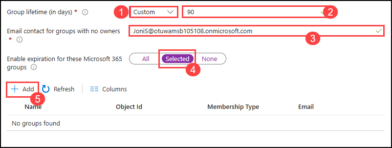

	- Select **+ Add** to open the **Select groups** right-side pane.

	- In the **Select groups** pane, type **Teams Rollout** into the textbox and select the group.

	- Use the **Select** button on the lower end of the right-side pane to apply the policy to the **Selected group**.

	- Back on the **Groups | Expiration** page, select **Save**.

		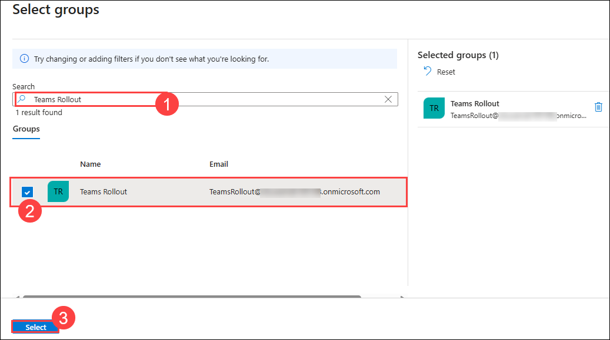

You have successfully created a new expiration policy and configured the **Teams Rollout** team to expire after 90 days. If the team doesn’t have an owner after 90 days, Joni Sherman will be notified about the expiration.

#### **Task 2 - Configure a group creation policy**

You are an administrator for your Team’s organization. You need to limit which users can create Microsoft 365 groups. You will create a security group named **GroupCreators** which only the members of the group can create Microsoft 365 groups.

1. Connect to the **Client 1 VM** and browse to the **Microsoft 365 admin center** (https://admin.microsoft.com/) as the Global admin - **ODL User** <inject key="AzureAdUserEmail" enableCopy="true"/>
and **password:** <inject key="AzureAdUserPassword" enableCopy="true"/>

2. In the Microsoft 365 admin center, select **Teams &amp; groups (1)** > **Active teams &amp; groups (2)**.

3. On the **Active teams and groups** page.

4. Create a security group. 

	- Navigate to the **Security groups (3)** tab.

        - Select the **+ Add a security group (4)** button.

			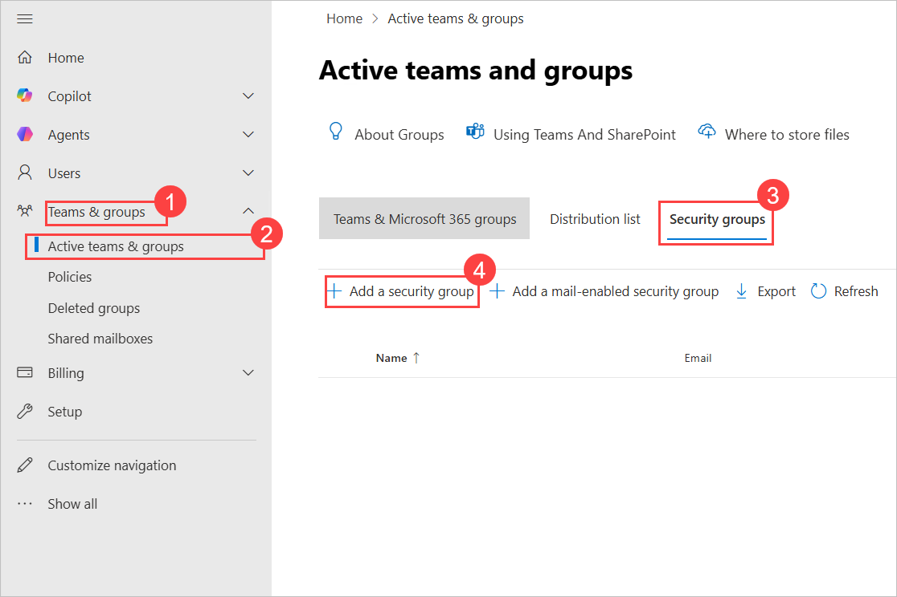
          
	- Fill out the following information:

		- Basics:

			- Name: **GroupCreators**
			- Description: **Users who can create Microsoft 365 Groups for new teams**
			- Select **Next**
    
       	- Settings:

            - Select **Next**

		- Finish: Select **Create Group** and then select **Close**

	- Back to **Active teams &amp; group** page, select **Security groups** tab and Select on the security group **GroupCreators** you just created.

	- Select **Members** tab to configure the **Owners** and **Members**.

	- Owners: Select **View all and manage owners** and select **+ Add owners.** Select **ODL User**.

		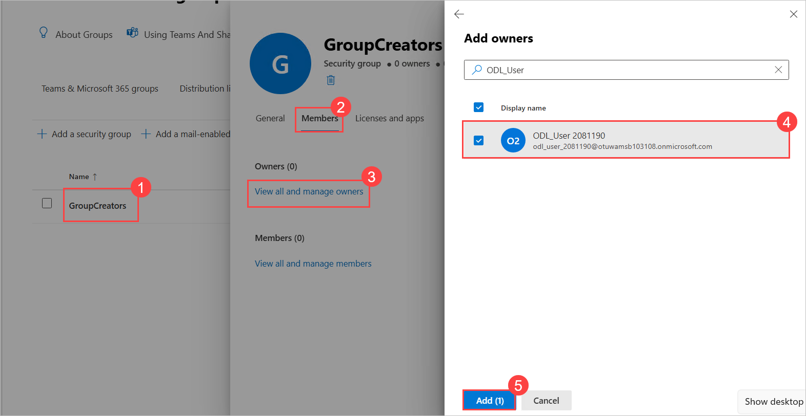

	- Members: Select **View all and manage members** > **+ Add members**, and add the following users:

		- Joni Sherman
		- Alex Wilber

		Restrict the Microsoft 365 groups creation to the security group.
   
	**Please note:** Microsoft PowerShell is soon to be deprecated and Microsoft Graph PowerShell will now be used. Therefore, both PowerShell and Microsoft Graph PowerShell commands are provided to complete this task. Users will be able to use either the PowerShell or Microsoft Graph PowerShell commands. Once PowerShell has been deprecated, please switch to using the Microsoft Graph PowerShell commands. 

	**Please note:** The **AzureADPreview** module is no longer functional on this tenant as the AAD Graph API has been deprecated. Complete all steps below using **Microsoft Graph PowerShell** only.

5. Open **Windows PowerShell** and run as Administrator.

6. Install the **Microsoft Graph Beta** module. Enter `Y` and press **Enter**
   to confirm installation from an untrusted repository.

   ```powershell
    Install-Module Microsoft.Graph.Beta
	```

8. Connect to Microsoft Graph with the required scopes. Sign in as
   **ODL User** when prompted.

   -	**Global admin -** **<inject key="AzureAdUserEmail"></inject>**

	-	**Password-** **<inject key="AzureAdUserPassword"></inject>**

	```powershell
    Connect-MgGraph -Scopes "Group.ReadWrite.All", "Directory.ReadWrite.All"
	```
	
9. Load the unified group directory setting template:

	```powershell
   $Template = Get-MgBetaDirectorySettingTemplate | Where-Object { $_.DisplayName -eq "Group.Unified" }
	```  

10. Check whether a directory setting already exists for this template. If not,
    create one:

	```powershell
    $Setting = Get-MgBetaDirectorySetting | Where-Object { $_.TemplateId -eq $Template.Id }
    if (-not $Setting) {
        $Setting = New-MgBetaDirectorySetting -TemplateId $Template.Id
    }
	```
	
11. Configure the group creation restriction and assign the **GroupCreators** group as the only permitted group:

	```powershell
    $params = @{
        Values = @(
            @{ Name = "EnableGroupCreation"; Value = "false" }
            @{ Name = "GroupCreationAllowedGroupId"; Value = (Get-MgGroup -Filter "displayName eq 'GroupCreators'").Id }
        )
    }

    Update-MgBetaDirectorySetting -DirectorySettingId $Setting.Id @params
	```
       
12. Review the applied settings and confirm the values are correct:

	```powershell
    (Get-MgBetaDirectorySetting -DirectorySettingId $Setting.Id).Values
	```

13. Verify that the output shows:

	-  **EnableGroupCreation** → false
	-  **GroupCreationAllowedGroupId** → populated with a GUID

    	>**Note:** Since this is a new tenant, there’s no directory settings object in the tenant yet. You need to use ```New-AzureADDirectorySetting``` to create a directory settings object for the first time.
	
14. Test the newly configured settings.

     - Connect to the **Client 2 VM** with the credentials that have been provided to you.

     - Test as **Alex Willber** from Teams desktop client, notice when select **Join or create a team**, there are options for **Create team** and **Join a team with a code**.     

     - Test as **Lynne Robbins** from Teams web client, notice when select **Join or create a team**, only one option **Join a team with a code** is available. 
	
	- If **Create team** option available try to create. It throws an error that **you don't have permission**.

        >**Note:** When you are still able to create a new team, wait several minutes for the new configuration to take effect on your users.

15. Revert the change for enabling users to create new teams.

16. Connect to the **Client 1 VM** where you have **Windows PowerShell** opened.  
    
17. Load the existing directory setting:

	```powershell
    $Template = Get-MgBetaDirectorySettingTemplate | Where-Object { $_.DisplayName -eq "Group.Unified" }
	```  
18. Get the existing active group settings in your tenant

	```powershell
 	$Setting = Get-MgBetaDirectorySetting | Where-Object { $_.DisplayName -eq "Group.Unified" }

	$Setting.Id
 	```
19.	Reset group creation to allow all users:

	```powershell
	$params = @{
       	 	Values = @(
           	 	@{ Name = "EnableGroupCreation"; Value = "true" }
            	@{ Name = "GroupCreationAllowedGroupId"; Value = "" }
        		)
    		}

    Update-MgBetaDirectorySetting 	-DirectorySettingId $Setting.Id @params
	```  
	
20. Verify the revert was applied:

	```powershell
	(Get-MgBetaDirectorySetting -DirectorySettingId $Setting.Id).Values
	```  
         
 	Verify that **EnableGroupCreation** is now **true** and **GroupCreationAllowedGroupId** is empty.

21. In the PowerShell window, enter the following cmdlet to disconnect the current session from Microsoft Graph.

	```powershell
	Disconnect-MgGraph
	```
	
22. Close the PowerShell window and continue to the next task.
	
In this task, you have successfully created a new security group and configured Azure AD settings to restrict the creation of new groups to members of this group only. At the end of the task, you have successfully tested the new group creation restrictions.

#### **Task 3 - Configure a new naming policy**

As part of your Teams planning project, you will configure the naming policy where each new Microsoft 365 group or team needs to comply with the organization’s regulations on naming objects. Each group name should start with the letters **Group** and end with the **Country** attribute of the owners’ location. Furthermore, there is an internal regulation that forbids using the following specific keywords in Teams names: **CEO**, **Payroll**, and **HR**.

1. Connect to the Client1 VM and browse to Entra admin center (https://entra.microsoft.com/) as **ODL User** <inject key="AzureAdUserEmail" enableCopy="true"/>
and **password:** <inject key="AzureAdUserPassword" enableCopy="true"/>

2. On the left navigation pane, select **Entra ID (1)** > **All Groups**.

3. On the **Groups (2)** page, select **Naming policy (3)** from the left hand side menu.

4. Configure **Blocked words**

    - Under the **Blocked words** tab on the **Groups | Naming policy** page, select **Download (4)** to download a sample file. 

		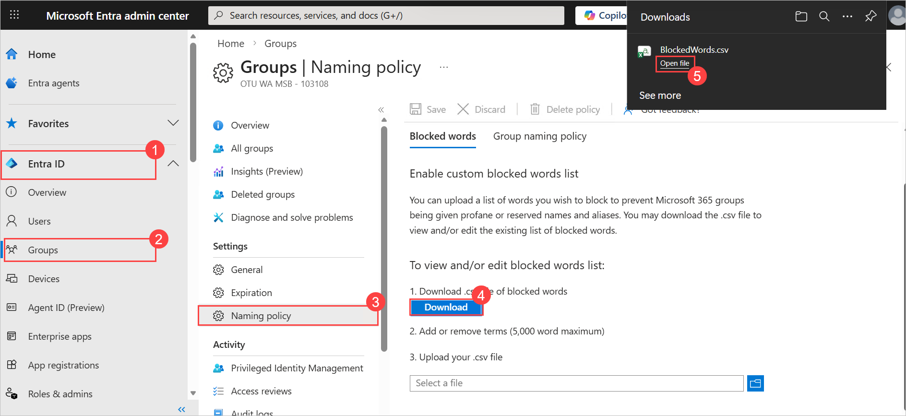
    
    - Navigate and right-select the downloaded file **BlockedWords.csv Open **Notepad** in desktop and select file in tab and click open and select the file you downloaded.

    - Type **CEO,Payroll,HR** replacing the empty quotes in the Notepad window, and saving the file. 
    
    - Back to the **Groups | Naming policy** page, upload the saved .csv file under **3. Upload your .csv file** by selecting **Select a file** box or the folder icon.

    - Select **Save** to apply the new blocked words setting.

		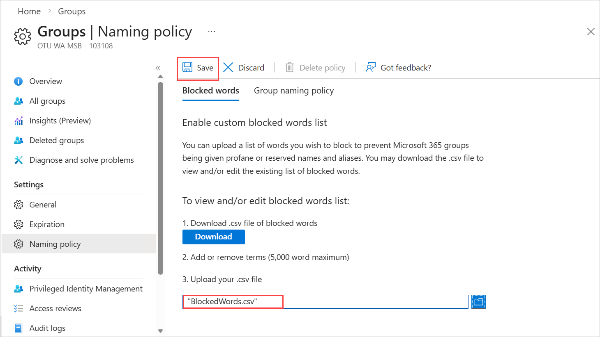

5. Configure **Group naming policy**
    
    - On the **Groups | Naming policy** page, select the **Group naming policy** tab.

    - Add **Group_ (1)** string as prefix 
        
        - Select the dropdown menu of **Select the type of prefix** and choose **String**.
        - Select the checkbox **Add prefix**. 
        - Enter **Group_** to the text box.

    - Add **Country or region (2)** string as the suffix 
        
        - Select the dropdown menu of **Select the type of suffix**, choose **String**, and enter **_** to the text box. 
		
	- Select the checkbox **Add suffix (2)**. 
        - Select the dropdown menu of **Select another suffix**, choose **Attribute**, and Select **Country or region** from the dropdown menu. 

		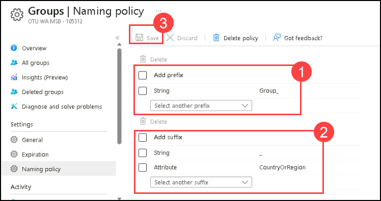
        
    - Select **Save (3)** to apply the new blocked words setting.

In this task, you have configured a naming policy that will block specific words to be used in a Microsoft 365 group name, as well as you have configured a new naming policy for the names of Microsoft 365 groups and teams.

#### **Task 4 - Test the new naming policy**

You need to test the newly created naming policy to see its effects in your pilot environment. In the following task, you will try to create a new team and see the configured naming policy template completing the configured name for your new team.

>**Note:** It can take up to 24 hours till the blocked words setting will take effect. Therefore, you will only test the configured naming policy, which takes effect immediately.

1. Connect to the **Client 2 VM** and open the **Teams desktop client** (https://teams.microsoft.com/) as **Alex Wilber** **<inject key="AlexWilber" enableCopy="true" style="color:blue" />** and  navigate to **environment tab** to get password.

2. In the Teams desktop client, select **Teams** from the left menu.

3. Select **+** in the upper right hand corner to **create and join teams and channels**.

4. Select **Create team** >Enter **Afterwork (1)** for the **Team name** > **Description** add anything > Team type as **Public (3)** > Enter **Afterwork (4)** for Name the first channel.

	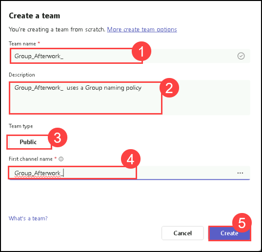

5. Select **Create (5)** to create the new team.It won't create. 

6. Add **Lynne Robbins** to the team member.

	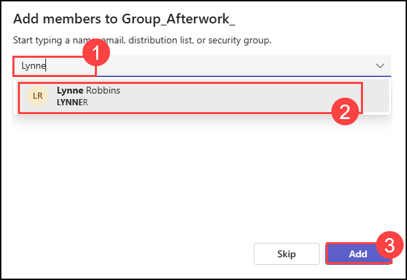

7. Review the name of the newly created team.

	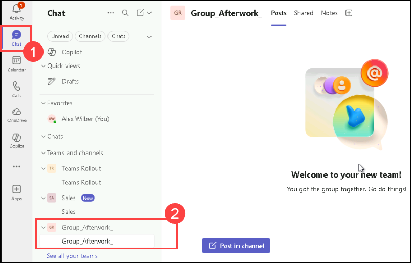

You have successfully tested the naming policy for managing the prefix and suffixes of user-created teams.

#### **Task 5 - Delete the naming policy**

You can remove the naming policy after the test. In the following task, you will remove the naming policy you just created.

1. Connect to the Client1 VM and browse to Entra admin center (https://entra.microsoft.com/) as **ODL User:** <inject key="AzureAdUserEmail" enableCopy="true"/>
and **password:** <inject key="AzureAdUserPassword" enableCopy="true"/>.

2. On the left navigation pane, select **Identity** > **Groups** > **All groups**.

3. Navigate to the **Group naming policy** tab.

5. Select **Delete policy** at the top ribbon > click **No**.

	> **Note:** Don't **delete the naming policy** where it is used in upcoming lab exercises.

	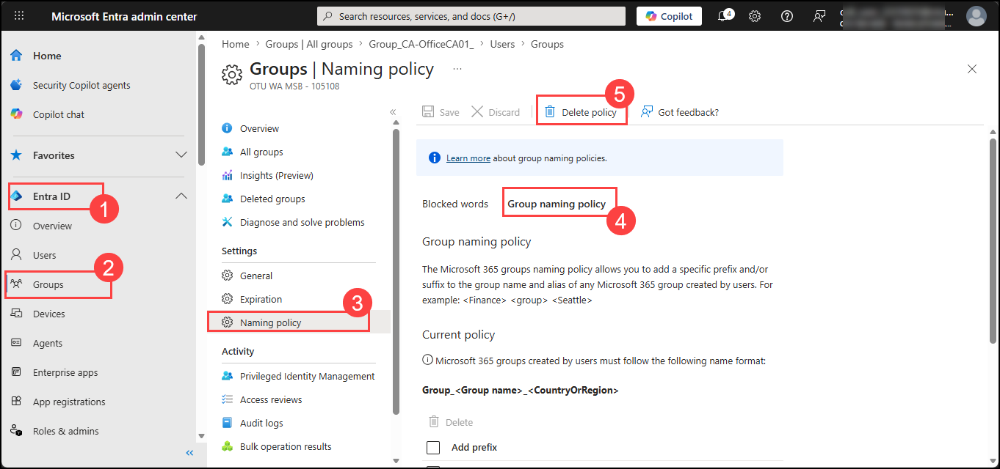

#### **Task 6 – Manage policy packages**

To avoid administrative overhead with managing large numbers of policies individually for groups of different users, you need to evaluate using policy packages to group policies into logical units. In this task, you need to review the default policy packages and change a default policy package for first-line workers.

1. Connect to the **Client 1 VM** and browse to Teams admin center (https://admin.teams.microsoft.com) as **Joni Sherman** **<inject key="JoniSherman" enableCopy="true" style="color:blue" />** and  navigate to **environment tab** to get password.

2. In the left navigation of the Teams admin center,click on **Show all**  select **Policy packages**.

3. On the **Policy packages** page, select **Frontline worker (default)** policy package.

	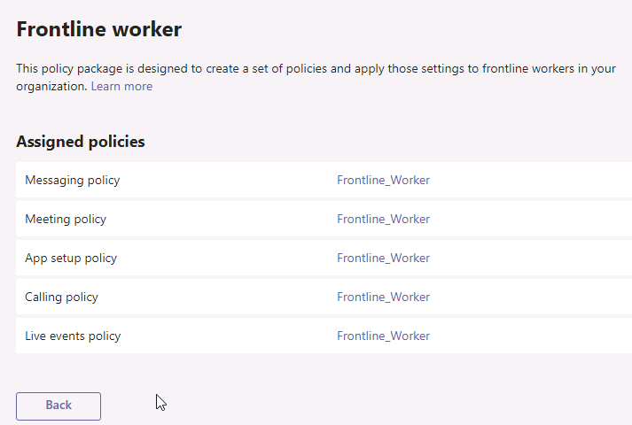

4. Check the box next to **Frontline Worker (Default)** and select **Manage Users** from the navigation ribbon.
   
5. Search **“Joni”** and select **Add** from the drop down. Then select **Apply** at the bottom.

	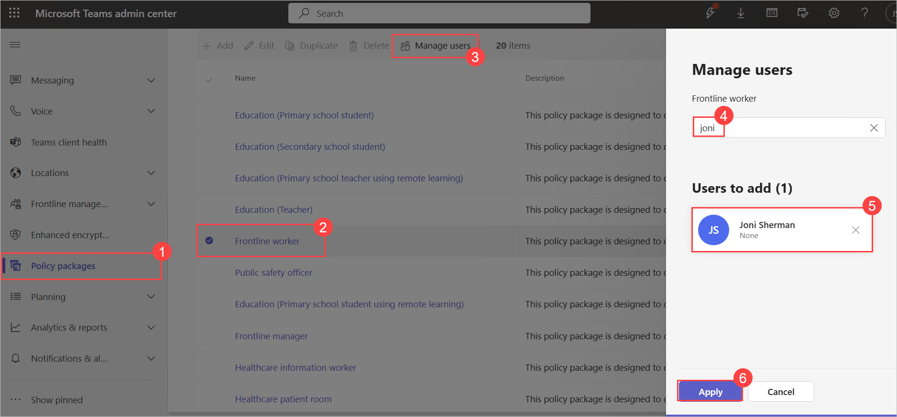
   
8. Navigate to the **Policies Tab** and click **Frontline_worker** and again Select **Frontline_Worker** next to **Messaging Policies**.

9. Turn on the setting - **Send urgent messages using priotiy notification** and select **Save**, if this setting is not already turned on.

10. Press **Confirm**.

12. Update Calling policy in **Frontline worker** policy package.

	1. Back to **Policy packages** page.
	2. Select **Frontline worker (default)** from the list again. 
	3. Select **Frontline_worker** right from **Calling policy**.
	4. Turn **On** the setting - **Prevent toll bypass and send calls through the PSTN**.
	5. Update **Busy on busy when in a call** to **On**.
	6. Select **Save**.
    7. Select **Confirm** and click **Back** button.

13. Navigate to **Policy Packages** from the left navigation pane.

14. Make sure **Frontline worker** policy package is checked.

15. Select **Manage users** from the top menu.

16. Type **Allan** into the search box, select **Add** right from **Allan Deyoung** and **Apply**.

17. Check the policy assignment.

	1. Select **Users** > **Manage users** from the left-side pane.

	2. Select **Allan Deyoung** and select **Policies** tab.

	3. You can see the **Frontline worker (Direct)** under policy package section.

You have successfully modified included policies from an existing policy package and assigned the package to a single user. This will help you assign the same set of policies to a group of users working in the same role or requiring the same access.
 
### **Exercise 5: Enable access to Teams public preview features using Teams update policies**

In this exercise, you will configure users to explore and evaluate upcoming features using Teams update policies. Public preview is enabled on a per-user basis, and Update policies are used to manage Teams and Office preview users who will see pre-release or preview features in the Teams app.

#### **Task 1 - Create a custom Update policy**

1. Connect to the **CLIENT1 VM** and browse to **Teams Admin Center** [https://admin.teams.microsoft.com](https://admin.teams.microsoft.com) as **Joni Sherman** **<inject key="JoniSherman" enableCopy="true" style="color:blue" />** and  navigate to **environment tab** to get password.

	>**Note**: You can use **InPrivate window** of Microsoft Edge for logging in with different credentials.

2. In left navigation of the Teams admin center, select **Teams** > **Teams update policies**. 

3. Select **+ Add**

4. Enter the following information:

	- Name: **Enable Preview features**
	- Description: **Enable Teams public preview**
	- Show preview features: select **On for everyone** 
	- Select **Apply** 

		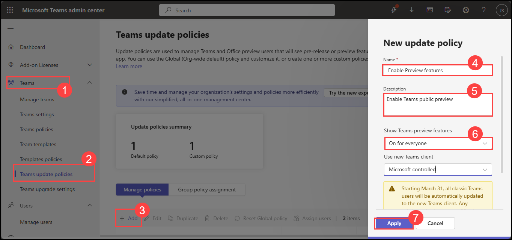

You now completed creating a custom **Teams Update policy.**
 
#### **Task 2 - Assign the custom Update policy to users**

Continue as **Joni Sherman** and you need to assign the custom Update policy to specific users because it doesn’t over-write the global policy.

1. Go to **Teams admin center** > **Teams** > **Teams update policies**.

2. Select the custom Update policy **Enable Preview features**.

3. Select **Assign users**.

4. Search and select **Add** next to the following pilot users:

	* Alex Wilber 
	* Lynne Robbins 
	* Diego Siciliani 

5. Select **Apply** then **Confirm** to assign the custom update policy created in task 1.

	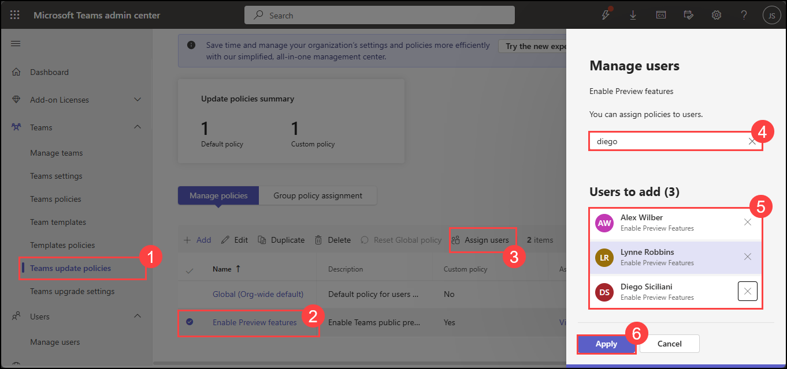

### You have successfully completed this lab. 

## Support Contact
 
The CloudLabs support team is available 24/7, 365 days a year, via email and live chat to ensure seamless assistance at any time. We offer dedicated support channels tailored specifically for both learners and instructors, ensuring that all your needs are promptly and efficiently addressed.
 
Learner Support Contacts:
 
- Email Support: [cloudlabs-support@spektrasystems.com](mailto:cloudlabs-support@spektrasystems.com)
- Live Chat Support: https://cloudlabs.ai/labs-support
 
### Click **Next >>** from the bottom right corner to embark on your Lab journey!
 

 
Now you're all set to explore the powerful world of technology. Feel free to reach out if you have any questions along the way. Enjoy your workshop!
 

