# Lab 04: - Manage Teams meetings and calling experiences

## Estimated Duration: 180 Minutes

# Student lab answer key

## Lab Scenario

In the labs of this course, you will assume the role of Joni Sherman, a Teams Administrator for Contoso Ltd., and her pilot team that shall evaluate the capabilities of Microsoft Teams in a testing environment. Teams admins need to configure conferencing functionalities, such as meetings and live event features that will provide the best user experience during collaboration and communication.

Your organization is also planning to purchase and deploy multiple Team devices. You will need to evaluate different devices profiles and configure profile settings for the devices and the process of creating Microsoft Teams room, where multiple Teams’ rooms will be purchased in your organization. 

Furthermore, you will replace Contoso legacy PBX solution and configure voice features that will provide users with Teams calling capabilities.

## Objectives

After you complete this lab, you will be able to:

- Manage meeting policies

- Configure meeting settings

- Create live event policies

- Create a webinar

- Create configuration profiles for devices

- Configure a new Microsoft Teams Room

- Set up a Calling Plan

- Order and Assign phone numbers

- Configure emergency addresses

- Create calling policies

- Configure resource accounts and calling queues

- Create resource accounts and auto attendants

- Access and navigate through call analytics ad CQD dashoards

## Lab Setup

- Estimated Time: 180 minutes.

## Instructions

### Exercise 1: Manage Live event and meetings experiences

Contoso organization has deployed Microsoft 365 and is testing pilot projects on collaboration and communication scenarios to meet business requirements. The Teams admin will configure meeting policies and schedule an initial webinar for testing purposes.

### Task 1 - Edit the default meeting policy and restrict all recording features for meetings

As part of your pilot project for setting up the events and meetings in your organization, you need to fulfill the requirement for all meetings in Teams, including prohibiting meeting recording. You will edit the default meeting policy to ensure that this requirement is met.

1. Connect to the **Client 1 VM** and browse to Teams admin center (https://admin.teams.microsoft.com) as **<inject key="JoniSherman" enableCopy="true" style="color:blue" />** and Enter the **password** - <inject key="User04Password" enableCopy="true"/> 

2. In left navigation of the Teams admin center, select **Meetings (1)** > **Meeting policies (2)**.

3. Select the **Global (Org-wide default) (4)** policy under **Manage policies (3)**.

   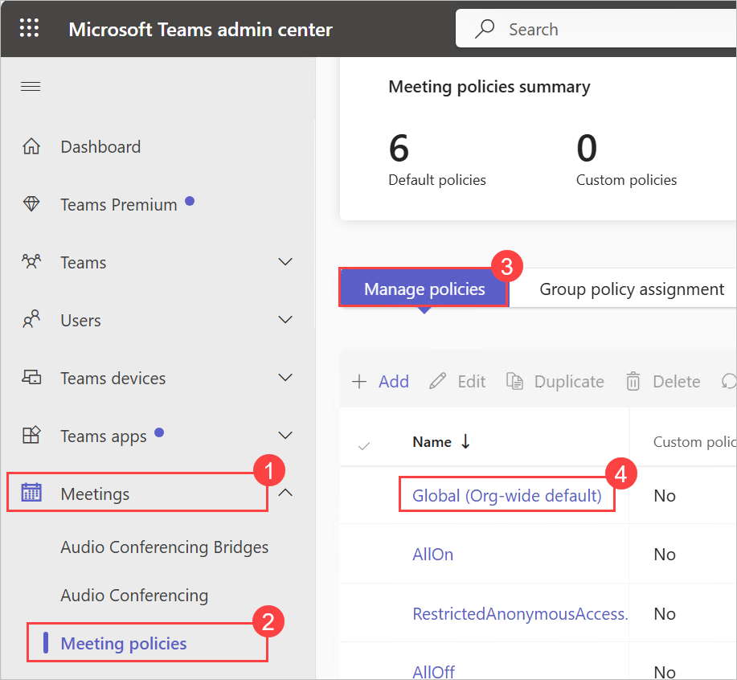

4. Turn **Off (1)** the **Meeting recording** setting under the **Recording & transcription** section.

5. Select **Save (2)** and **Confirm**.

   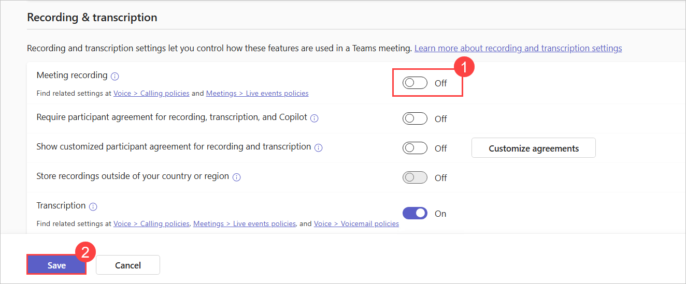

You have successfully modified the Global (Org-wide default) meeting policy and disabled the recording functionality for meetings. It will take some time for the changes to be applied to the users, so you will continue with the next task and test the configured settings at the end of this lab.

### Task 2 – Test the meeting policy for restricting recording

In this task, you need to sign in to the second client and create a meeting with a user. You will see how the configured policy works and users won’t be able to record a meeting.

1. Connect to the **Client 2 VM** and browse to the [**Microsoft Teams web client (https://teams.microsoft.com/)**](https://teams.microsoft.com/) as **<inject key="LynneRobbins" enableCopy="true" style="color:blue" />** and Enter the **password** - <inject key="User01Password" enableCopy="true"/> 

2. Select **Calendar (1)** from the left navigation pane.

3. Select **Meet Now (2)** > **Start meeting (3)** from the upper right corner.

   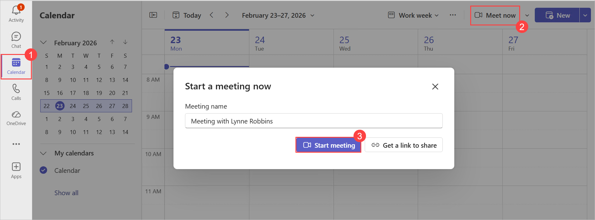

4. Select **Join now** to start the meeting.

5. Close **Invite people to join your window** by selecting **X** on the upper right corner, if prompted.

6. In the meeting window, select … for **More actions (1)**.

7. Notice that you can’t select **Start recording (2)**.

	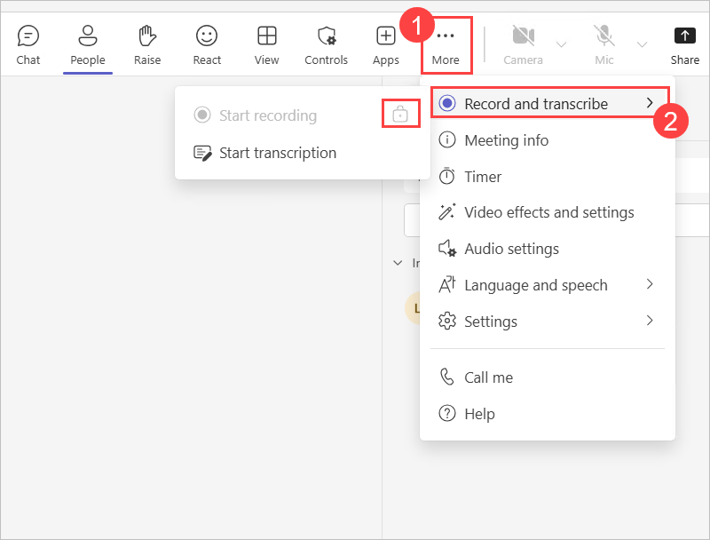

8. End the meeting.

### Task 3 - Configure meeting settings and restrict anonymous users from joining meetings

Contoso Ltd. works with several external partners, and users often schedule meetings with external partners for projects collaboration. However, according to the company regulations, external partners need to identify themselves with a valid account, and anonymous access needs to be forbidden. You need to configure Microsoft Teams to disable anonymous access to meetings.

1. Connect to the **Client 1 VM** and browse to Teams admin center (https://admin.teams.microsoft.com) as **Joni Sherman** **<inject key="JoniSherman" enableCopy="true" style="color:blue" />** and Enter the **password** - <inject key="User04Password" enableCopy="true"/> 

2. In left navigation of the Teams admin center, select **Meetings (1)** > **Meetings settings (2)**.

3. On the **Meetings settings** page, turn **Off (3)** the option **Anonymous users can join a meeting** in the participants section.

4. Select **Save (4)** and **Confirm**.

	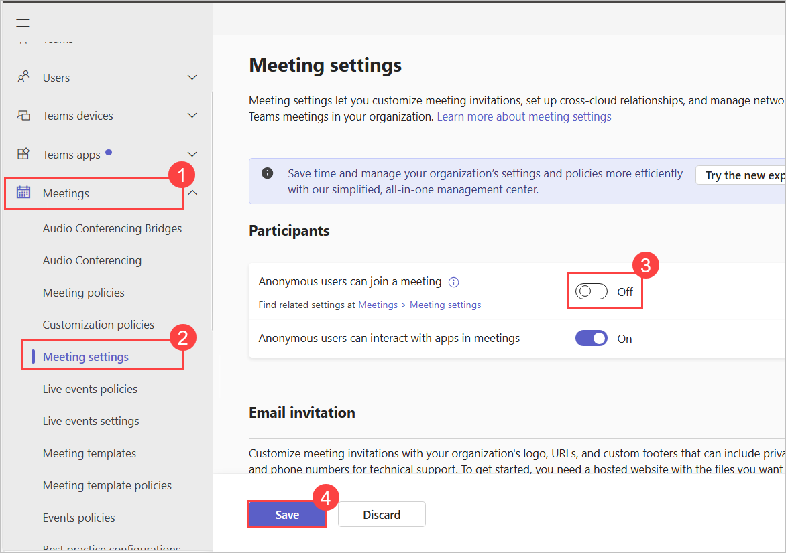

You have successfully modified the meeting settings for all users in your tenant and disabled anonymous access to any meetings. It will take some time for the changes to be applied to the users, so you will continue with the next task and test the configured settings at the end of this lab.

### Task 4 - Create a new live event policy and restrict recording capabilities

Contoso Ltd. wants to broadcast video and meeting content to large online audiences. As a Teams admin, you need to evaluate live events functionalities, including creating live events and configuring live event policies. According to Contoso Ltd. business requirements, you will need to restrict the recording options for participants of meetings and only allow recording options to manage users. Only the organizer of a live event should be able to record his meetings.

1. Connect to the **Client 1 VM** and browse to the **[Microsoft Teams admin center (https://admin.teams.microsoft.com)](https://admin.teams.microsoft.com)** as **Joni Sherman** **<inject key="JoniSherman" enableCopy="true" style="color:blue" />** and Enter the **password** - <inject key="User04Password" enableCopy="true"/> 

2. In the left navigation of the Teams admin center, select **Meetings** > **Live events policies**.

3. Select **+Add** under **Manage Policies** tab.

4. On the **Live events policies\Add** page, enter the following information:

	- Add live events policy Name: **Management Live Events (1)**

	- Description: **Recording Restriction for live events organized by managers (2)**

	- Live events scheduling: **On (3)**

	- Transcription for attendees: **Off (4)**

	- Who can join scheduled live events: **Everyone in the organization (5)**

	- Who can record an event: **Organizer can record (6)**

5. Select **Save (7)**.

	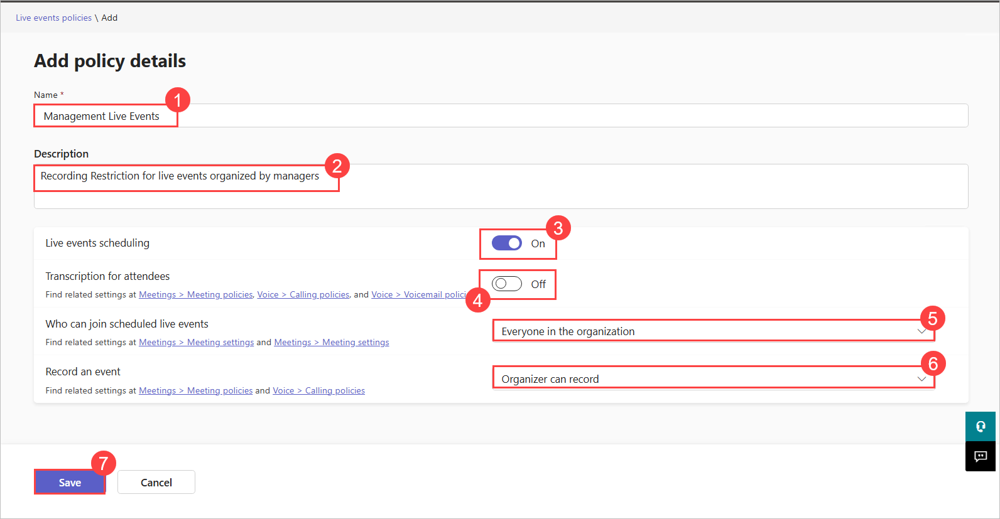

6. Back on the **Live events policies** page, select **Management Live Events** policy and select **Manage Users** select **Assign users** from the top menu.

7. In the **Manage users** pane, search and add **Lynne Robbins**.

8. Select **Apply** then **Confirm** to assign the policy to the selected user.

	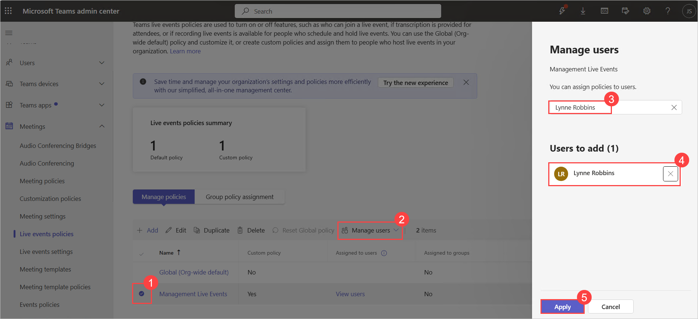

You have successfully created a custom Live event policy and assigned it to a user.

### Task 5 – Create a webinar

The IT department wants to host a company-wide meeting to answer employees’ questions regarding the new reporting system. As a Teams admin, you will create a webinar allowing employees to submit their questions before the meeting.

1. Connect to the **Client 1 VM** and browse to **[Microsoft Teams web client (https://teams.microsoft.com/)](https://teams.microsoft.com/)** as **Joni Sherman** **<inject key="JoniSherman" enableCopy="true" style="color:blue" />** and Enter the **password** - <inject key="User04Password" enableCopy="true"/> 

2. In the Teams Calendar, select the dropdown menu **New (1)** and select **Webinar (2)**. The **New webinar | Microsoft Teams** tab will open.

	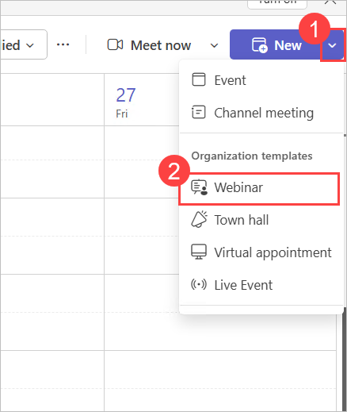

3. Enter the **Basic info** and then select **Save and send invites**:

	- **webinar title**: IT Office Hours
	- **Start/End**: Select a time close to your current time 
	- **Give your webinar a description**: Company-wide meeting to answer questions regarding the new reporting system.
	- **Presenters**: Patti Fernandez, Allan Deyoung
	- **Co-organizers**: Diego Siciliani
	- **Event access**: Your organization

		>**Note**: When you save the event, invites will be sent to presenters and co-organizers automatically. 

		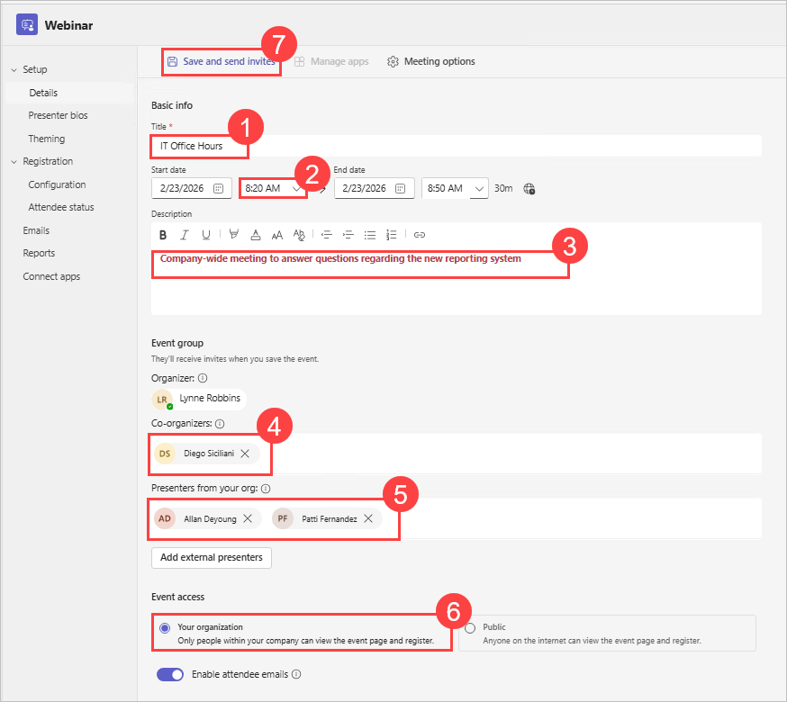

4. Review the **Meeting options**, the **Presenter bios** and **Theming**, by selecting the options on the left hand side navigation. Press **Save** if prompte first.

5. Complete the Registration site configuration. On the **IT Office Hours | Microsoft Teams** tab, at the left, expand **Registration** and select **Configuration**. Enter the following information and then select **Save**: 

	- **Capacity**: 1000
	- Under **Form** select **+ Add field** > **Custom question** > **Text input** and enter the following in the textbox below **Custom question**:

		*What is your question about the new reporting system?*

		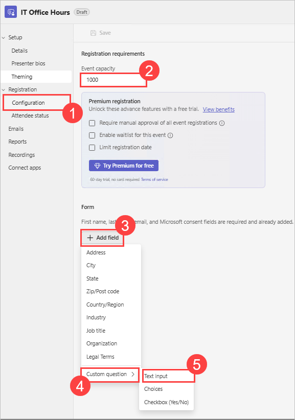
		 
6. Preview the registration site by selecting **View draft**. The preview of the registration page opens in a new tab. After reviewing the site, close the tab.

	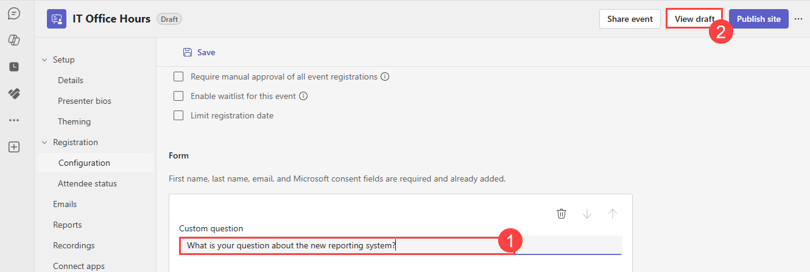

	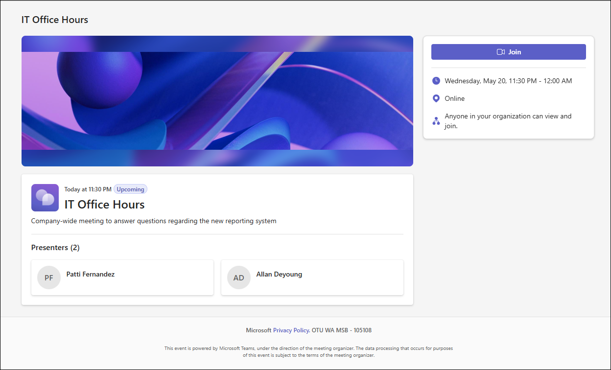

7. Publish the Registration site and share the link:

	1. On the **IT Office Hours | Microsoft Teams** tab, select **Publish site** and then selet **Publish** to activate the Webinar registration site.

		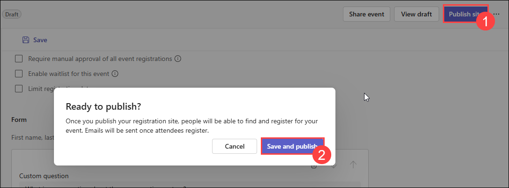

	2. Copy the **Share link**, close the **All set and ready to share** window and the **IT Office Hours | Microsoft Teams** tab.

		

	3. Navigate back to **Teams** on the left hand side navigation. 
	
	4. On the left navigation pane, select **General** under the **IT-Department**. Select **Post in Channel** and paste the copied registration link in the new conversation text box and select **post**.

		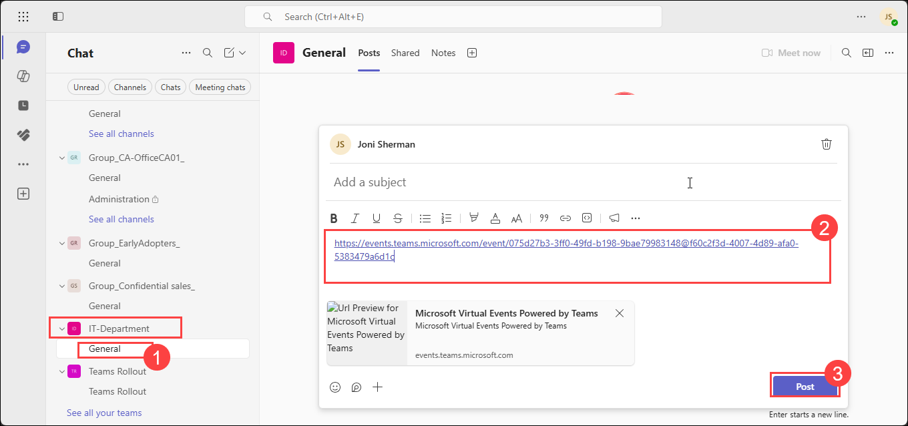
	5. Sign out and close all browser windows.
		
8. Test the meeting registration. 

	1. Stay in the **Client 1 VM** and browse to **[Microsoft Teams web client (https://teams.microsoft.com/)](https://teams.microsoft.com/)** as **ODL User** <inject key="AzureAdUserEmail" enableCopy="true"/>
and **password:** <inject key="AzureAdUserPassword" enableCopy="true"/>

	2. Go to the **General** channel of the **IT Department** team and select the registration link that you posted.

		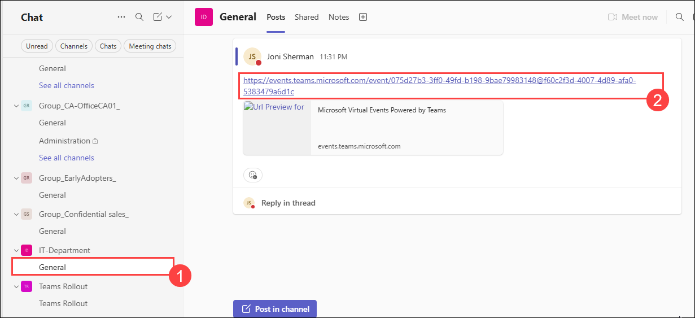

	3. On the registration page select **Register**, verify that the MOD Administrator's name and email have been entered, select the **Microsoft Event Terms and Conditions** check box, and then select **Register**.

	4. Open a new browser tab and browse to **[MOD Administrator's mail (https://outlook.office.com/mail/)](https://outlook.office.com/mail/)** and view the email with subject: **You're registered for IT Office Hours**.
	
	5. Sign out and close all browser windows.

You have successfully created a webinar with a custom registration form.

### **Exercise 2: Deploy Teams device profiles**

As a Teams administrator, you will create configuration profiles to manage settings and features for Teams devices in your organization. You can create or upload configuration profiles to include settings and features you want to enable or disable and then assign a profile to a device or groups of devices.

Your organization could purchase Microsoft Teams Rooms that provide a complete meeting experience with HD video, audio, and content sharing in conference rooms. You will need to prepare the deployment prerequisites by defining Microsoft Teams Rooms service account in Office 365.

### Task 1 - Create configuration profiles

During the planning phase of Teams Phones devices in your organization, you want to evaluate settings that can be applied to Teams devices by using configuration profiles in Teams admin center. You will create a configuration profile for Teams device and analyze settings that will include in the configuration profile. Once devices are deployed into your organization, you will be ready to apply configuration profiles to those devices.

1. Connect to the **Client 1 VM** and browse to Teams admin center (https://admin.teams.microsoft.com) as the Teams device administrator - **Patti Fernandez**  **<inject key="PattiFernandez" enableCopy="true" style="color:blue" />** and Enter the **password** - <inject key="User03Password" enableCopy="true"/> 

2. In **Teams admin center**, on the left navigation pane, select **Phones (1)** under **Teams devices (2)**.

3. On the **Phones** page, select **Configuration profiles (3)** tab, and then select **+ Add (4)**.

	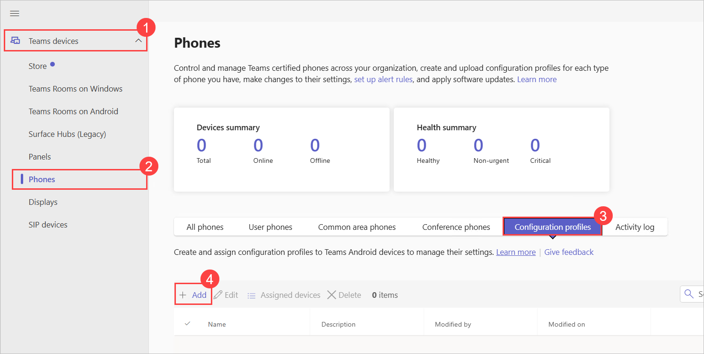

4. Enter the following information for the new configuration profile:

	- Configuration profile Name: **New York Teams Desk Phones**

	- Description: **Configuration profile for Teams Desk Phones in New York HQ**

5. Under **General** section, configure following settings:

	- Device lock: **On**

	- Timeout: **30 seconds**

	- PIN: **123456**

	- Language: English **(United States)**

	- Timezone: **(UTC-4:00) Eastern Time (US and Canada)**

	- Date format: **MM/DD/YYYY**

	- Time format: **12 Hours (AM/PM)**

		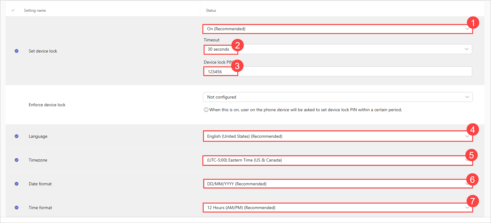

6. Under **Device settings** configure following settings:

	- Display screen saver: **On, Timeout 1 minute**

	- Display high contrast: **On**

	- Office hours: **08:00-17:00**

	- Power Saving: **On**

		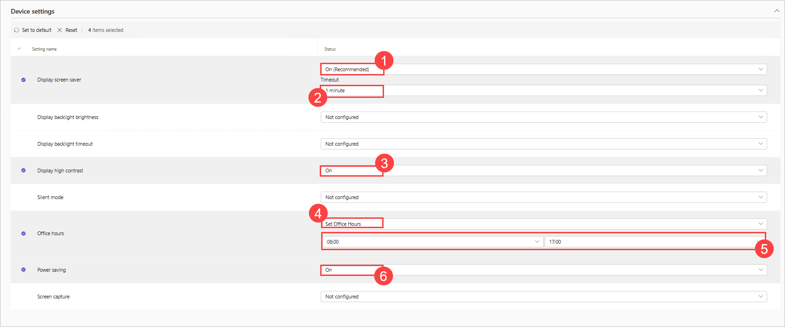

7. Under **Network settings**, configure following settings:

	- DHCP enabled: **On**

	- Logging enabled: **Off**

	- Device’s default admin password: **Pass@word1**

		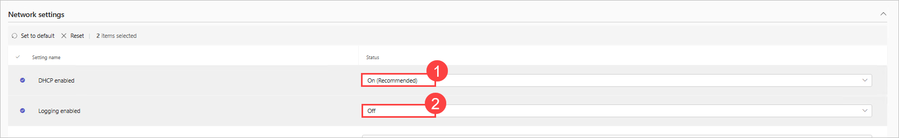

		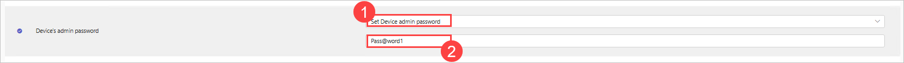

8. Once you complete with the configuration profile settings, Click on **Review changes** and select **Save changes**.

9. Sign out and close all browser windows.

In this task, you have successfully created a configuration profile that can be applied to Microsoft Teams devices.

### Task 2 - Configure a resource account for Teams Room

Your organization has ordered devices for Microsoft Teams room. In the meantime, you need to ensure that all prerequisites for the equipment installation are being completed. One of the prerequisites for Microsoft Teams Room deployment is adding a device account and assigning Office 365 license for that account.

>**Note:** You may choose to use the Exchange Online PowerShell to complete this task, however, you will need to first install the new Exchange PowerShell module.

1. Connect to the **Client 1 VM** and browse to Microsoft 365 admin center (https://admin.microsoft.com/) as **ODL User** <inject key="AzureAdUserEmail" enableCopy="true"/>
and **password:** <inject key="AzureAdUserPassword" enableCopy="true"/>

2. Create a Microsoft 365 resource account for Teams Rooms.
	1. In left navigation of the Microsoft 365 admin center, select **Show all** > **Resources (1)** > **Rooms & equipment (2)**. If you don't find **Resources**, search for **Rooms & equipment** from the top search bar and select.

	2. On the Rooms & equipment screen, select the **+ Add resource (3)** option to add a new resource account. 

	3. On the **Add resource** page, follow the wizard with the following information. 

		* Resource type: **Room (4)**.
		* Name: **NY-TeamsRoom1 (5)** 
		* Email: Enter **NY-TeamsRoom1 (4)** inside the Email text box and verify your tenant id in the domains

	4. Select **Save (7)**.

		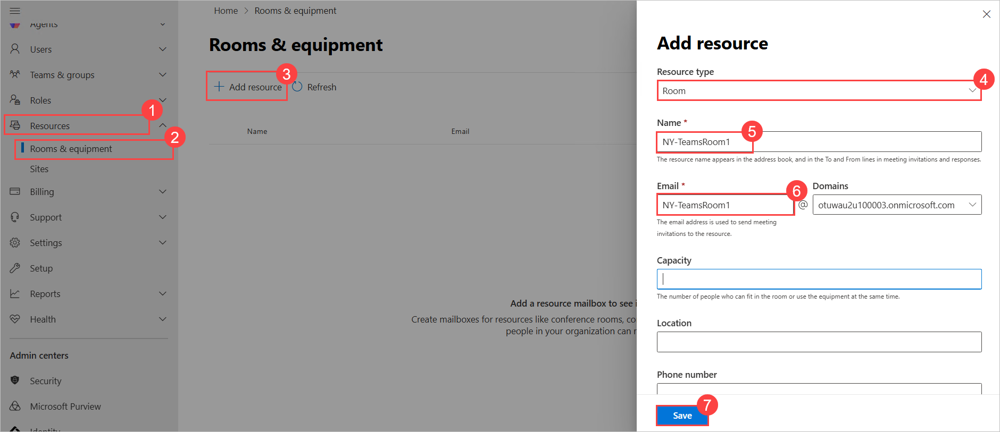

	5. Select **Edit booking options**, keep the default settings with the following checked.

		* Allow repeating meetings
		* Automatically decline meetings outside of the limits
		* auto-accept meeting requests

			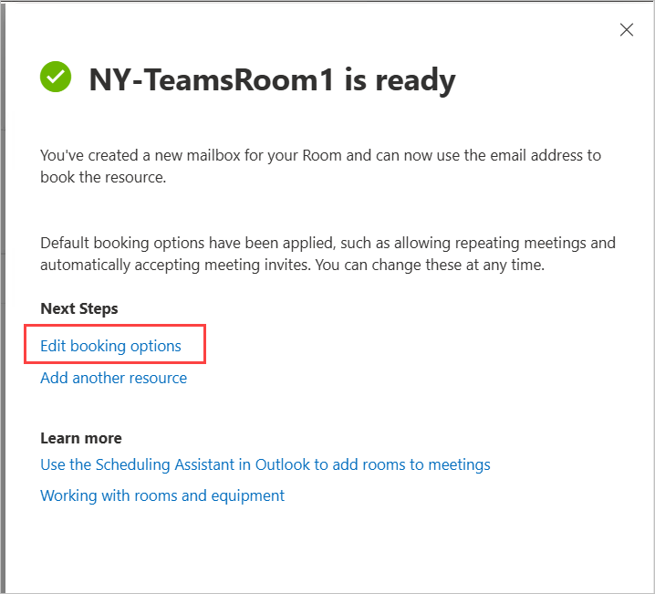

			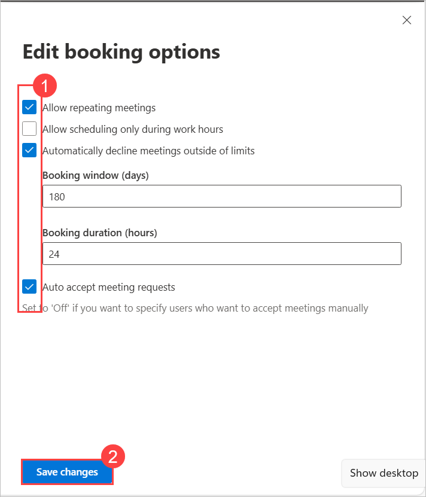

3. Assign the license to the Teams Rooms account.

	1. In the **Microsoft 365 admin center** from the left navigation pane, select **Users (1)**, and then choose **Active Users (2)**.

	2. Select the NY-TeamsRoom1@&lt;YourTenant&gt;.onmicrosoft.com account **(3)**, and then select the **Manage product liscenses (4)** tab.

		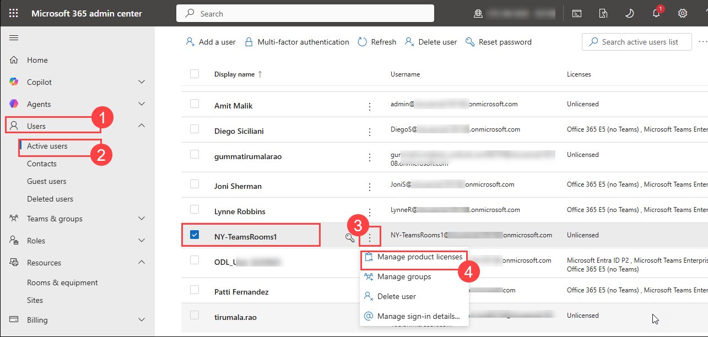

	3. In the NY-TeamsRoom1@&lt;YourTenant&gt;.onmicrosoft.com page, under the **Licenses and Apps** tab, select **Available licenses** and then select **Save changes**.

		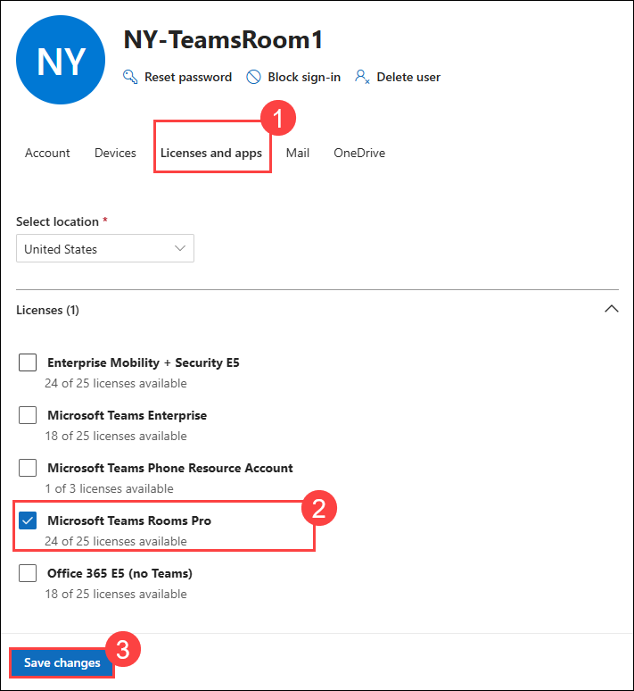

4. Sign out and close all open windows.

You have successfully created, configured, and licensed a Microsoft Teams Room service account, which is a prerequisite for deploying a Microsoft Teams Room system.
 

### **Exercise 3: Set up a Calling Plan (Read-Only)**

In this exercise, you will set up one of your users with a Calling Plan Trial. You will need to start the trial, order a phone number from Microsoft as your provider and enable your user to use this phone number when making outgoing calls.

>**Note:** The availability of Calling Plans varies based on different countries and regions. Please go to the link below to check the availability of your location. The following instruction is based on the location of the United States.

[https://docs.microsoft.com/en-us/microsoftteams/country-and-region-availability-for-audio-conferencing-and-calling-plans/country-and-region-availability-for-audio-conferencing-and-calling-plans](https://docs.microsoft.com/en-us/microsoftteams/country-and-region-availability-for-audio-conferencing-and-calling-plans/country-and-region-availability-for-audio-conferencing-and-calling-plans)

### Task 1 - Add a new emergency address

In this task, you will add a new emergency address “One Microsoft Way, Redmond, WA 98052, USA” for users in the United States. It is used to route emergency calls to the appropriate dispatch authorities and to assist in locating the emergency caller.

1. Connect to the **Client 1 VM** and browse to the **Teams admin center** at [**https://admin.teams.microsoft.com/**](https://admin.teams.microsoft.com/) as **Joni Sherman**  **<inject key="JoniSherman" enableCopy="true" style="color:blue" />** and Enter the **password** - <inject key="User04Password" enableCopy="true"/> 

2. On the left navigation pane select **Locations (1)** > **Emergency addresses (2)**.

3. Select **+ Add (3)** from the top pane to create a new emergency address.

	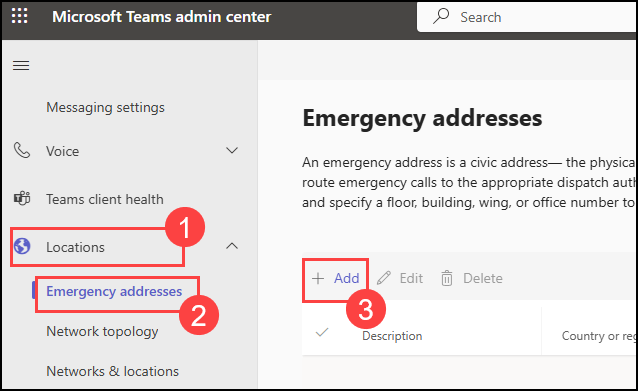

4. On the **Emergency addresses\New emergency address** page, enter the following information:

	- Put in a name for your location: **Contoso Emergency Address (1)**

	- Country or region: **United States (2)**

	- Address: **1 Microsoft Way, Redmond, WA 98052 (4)**

		(You can enable **Input address manually (3)**, and enter the address manually)

5. Acknowledge the emergency calling disclaimer. An information page opens, either **Print** or **Cancel** the page and continue to the next task.

6. Select **Save (6)**.

	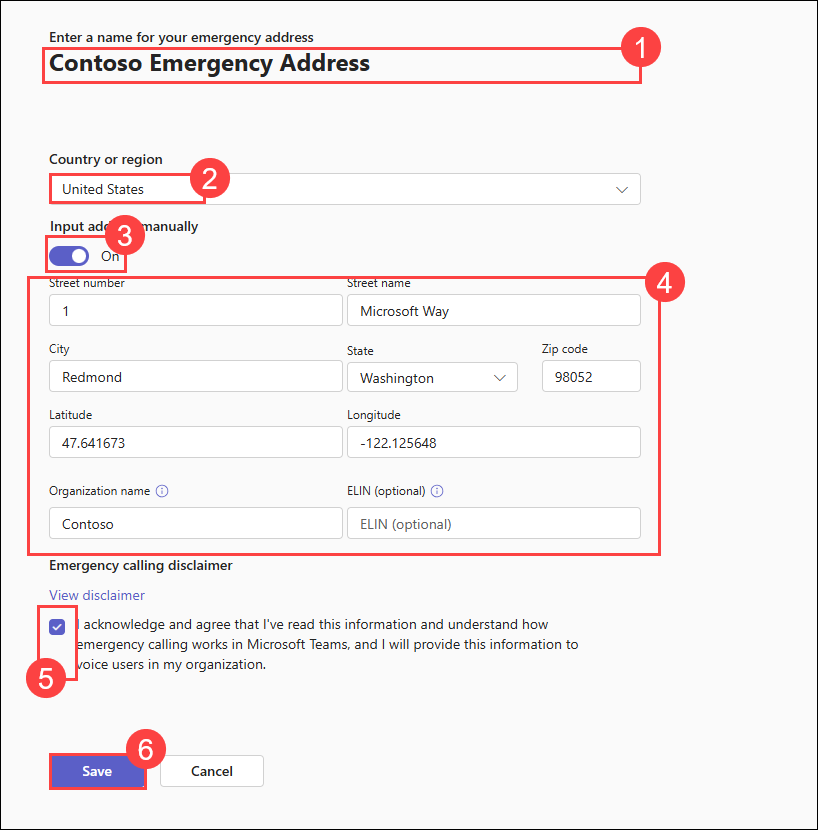

7. Sign out and close the browser.

You have successfully created an emergency address that can be used for phone numbers.

### Task 2 – Assign a Calling Plan license to a user

In this task, you will assign the calling plan license to a user to allow them to make domestic calls via the public switched telephone network.

1. Connect to the **Client 1 VM** and sign in with the Credentials that have been provided to you.

2. You should still be in the **Microsoft 365 admin center** and signed in as **ODL User** <inject key="AzureAdUserEmail" enableCopy="true"/>
and **password:** <inject key="AzureAdUserPassword" enableCopy="true"/>

3. Open the Navigation Menu in the upper left corner and select **Users (1)**.

4. Select **Active users (2)**.

5. Search for **Lynne Robbins (3)** and open the additional settings by selecting her name.

	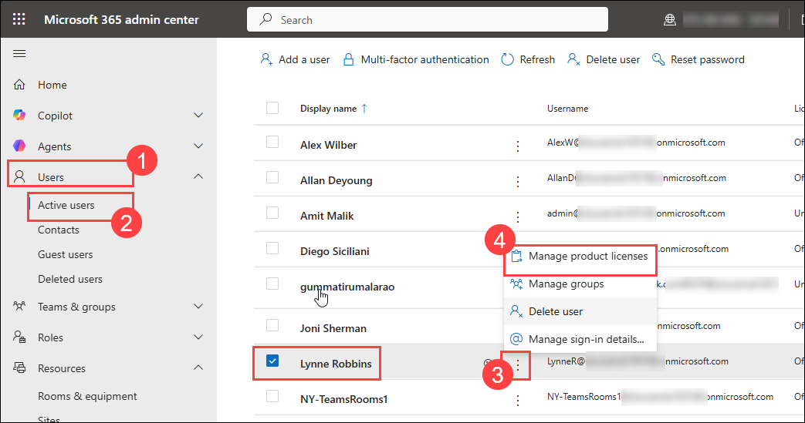

6. Select **Licenses and apps**.

7. Under **Licenses** select **Microsoft Teams Domestic Calling Plan** by setting the checkmark in front of it.

8. Select **Save Changes** to assign the license and then sign out and close all open windows.

You have assigned the Calling Plan license to a user. With this license assigned your users can use the Calling Plan features and receive a phone number.

### Task 3 – Order a phone number for your user (Instructional steps only - do not complete)

In this task, you will order a phone number for a user with an assigned Calling Plan license.

1. Connect to the **Client 1 VM** and sign in with the Credentials that have been provided to you.

2. In the **Microsoft Teams client** sign in as **Joni Sherman** **<inject key="JoniSherman" enableCopy="true" style="color:blue" />** and Enter the **password** - <inject key="User04Password" enableCopy="true"/> 

3. Navigate to the **Teams admin center** at [**https://admin.teams.microsoft.com/**](https://admin.teams.microsoft.com/).

4. On the left navigation pane, select **Voice**, and then **Phone numbers** below.

5. Select **+ Add** in the right pane.

	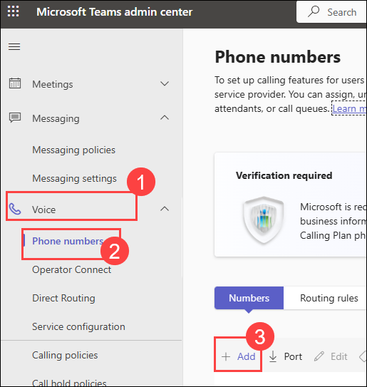

6. Type **Phone number order** as the **Order Name**.

7. Fill out the description as **Number for Lynne Robbins during the Calling Plan trial**.

8. In the dropdown menu of **Country or region**, select **United States**.

9. For **Number Type** select **User (Subscriber)**.

10. For the **Operator**, pick **Microsoft**.

11. For **Quantity** type **1**.

12. In the **Search for new numbers** section, you can use one of the following approaches to find new numbers:

	- Search by city name

		- Select **Search by city name**.

		- Search **Redmond** and select **Contoso Emergency Address**, which is the location you just created.

		- Select Area code **425**.

		- Select **Next**.

	- Search by area code

		- Select **Search by area code**.

		- Enter an area code in United States.

		- Select **Next**.

			>**Note**: If you received the following message, please try other area codes or create another location by selecting **Add a location** which is next to the **Search by city name**. It will navigate to the **New emergency address** pane, enter the new name for the emergency address, then in the **Country or region** select **United States** and enter the new address manually in the **Address** field by enabling the slider **Input address manually** and select **Save**. It takes back to the **Get Phone numbers** page and continues the city search with the newly created emergency address to acquire the phone number.

			*We can’t find any phone numbers for the address you selected.*

13. Once you reserved a phone number successfully, you can proceed by selecting **Place order**, then **Finish**.

	>**Note:** It might take some time for the phone numbers to show up. You can check your order from the **Order history** tab.

You just ordered a phone number for a User in Microsoft Teams. This is the same process you use to order numbers for all other Microsoft Teams services such as Call Queues.

### Task 4 – Assign a phone number to your user (Instruction only don't complete this task)

In this Task, you will assign an existing phone number to a user.

1. Connect to the **Client 1 VM** and sign in with the Credentials that have been provided to you.

2. You should still be in the **Teams admin center** and signed in as **Joni Sherman** **<inject key="JoniSherman" enableCopy="true" style="color:blue" />** and Enter the **password** - <inject key="User04Password" enableCopy="true"/> 

3. On the left navigation pane, select **Voice**, and then **Phone numbers** below.

4. Select the phone number you want to assign and select **edit** to open the options.

5. Under **Assigned to** search for **Lynne Robbins** and select **assign**.

6. Under **Emergency Location** select **Search by the location description**.

7. Type **Contoso** to search for the emergency location you created earlier.

8. Select **Apply** to assign the phone number to the user.

### **Exercise 4: Manage Teams Phone** 

Contoso organization is using the legacy PBX system. With the introduction of Microsoft Teams, Contoso will migrate their legacy telephony system to Microsoft Teams Phone. Teams admins are responsible for evaluating and testing Microsoft Teams voice functionalities.

### Task 1 - Create a calling policy

As part of your pilot project for calling functionalities with Microsoft Teams, you have the requirement that all pilot users receive access to the voicemail functionalities. You create and assign a new calling policy and configure the settings. However, all other users should not receive voicemail functionalities during the testing period. Therefore, you will edit the default policy to ensure that voicemail is disabled for all other users.

1. Connect to the **Client 1 VM** and sign in with the Credentials that have been provided to you.

2. You should still be in the **Teams admin center** and signed in as **Joni Sherman** **<inject key="JoniSherman" enableCopy="true" style="color:blue" />** and Enter the **password** - <inject key="User04Password" enableCopy="true"/> 

3. On the left navigation pane, select **Voice (1)**, and then **Calling policies (2)** below.

4. Select the **Global (Org-wide default) (3)** policy to **edit (4)** the default settings.

	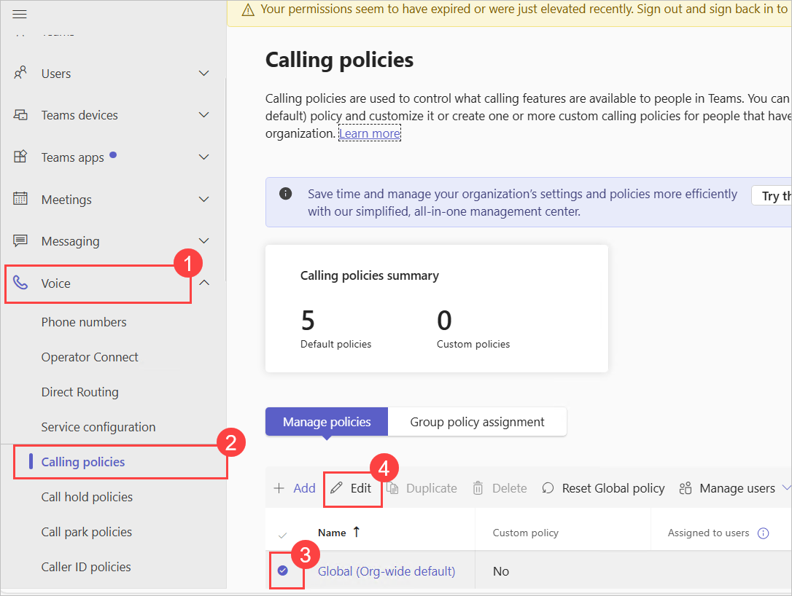

5. In **Calling policies\Global**, use the dropdown menu to the right of **Voicemail for inbound calls** and select **Off**. Then select **Save** and **Confirm**.

	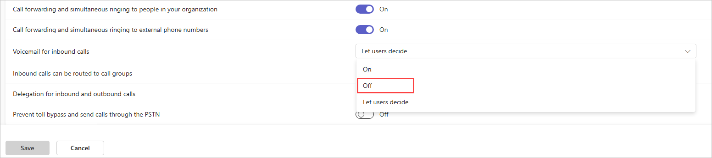

6. Back on the **Calling policies** page, select **+ Add** on the top pane, to create a new policy.

7. Enter the following information:

	- Add new calling policy: **Voicemail enabled pilot users** **(1)**

	- Description: **Calling policy that allows voicemail for selected pilot users**. **(2)**

	- **(3)** Voicemail for inbound calls: **On** **(4)**

		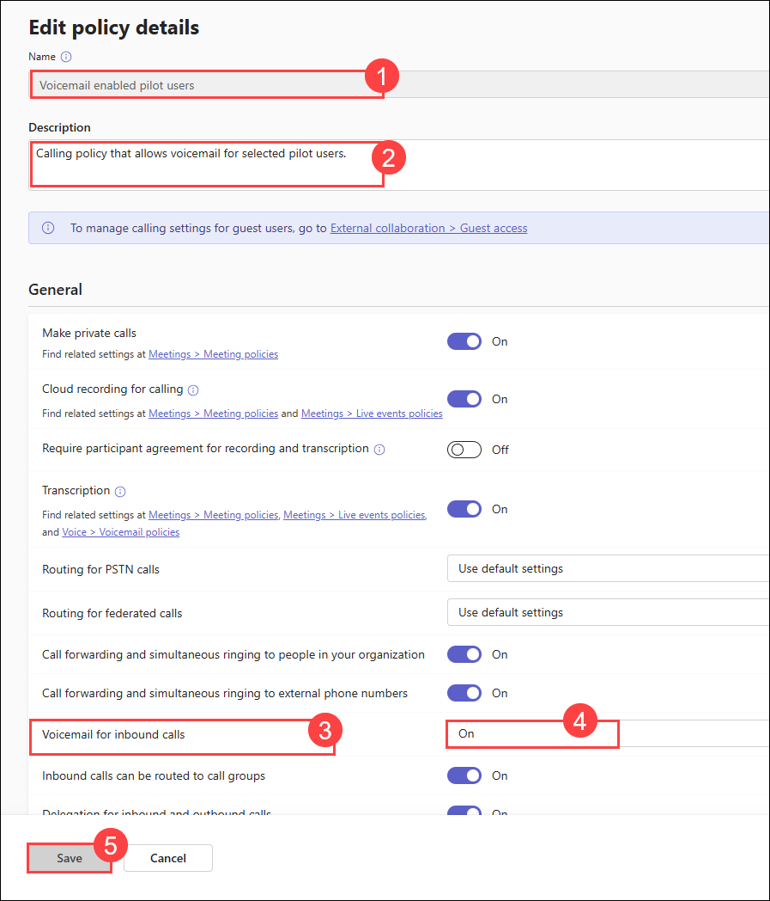

8. Select **Save (5)** to create the new policy.

9. Back on the **Calling policies** page, use the checkbox left to the **Voicemail enabled pilot users (1)** policy and then select **Manage Users** then **Assign users (2)** from the top pane.

	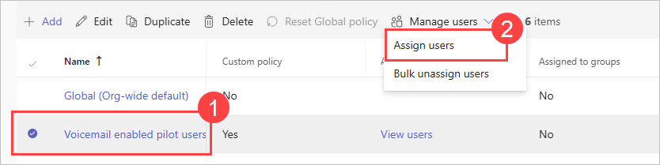

10. In the right-side pane, type into the search field **Diego** then select **add**. Repeat the same steps for **Alex, Joni and Lynne**.

	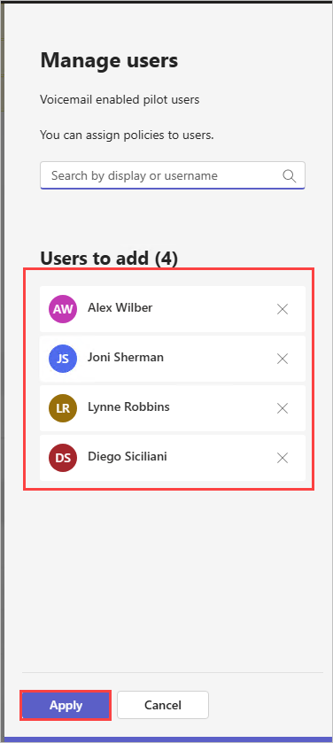

11. Select **Apply** to assign the policy to the selected users, then **Confirm**.

In this task, you have disabled voicemail for all users in the organizations, and then you have created a calling policy that will enable voicemail for several users.

### Task 2 - Create a call queue

Contoso Ltd. has deployed Microsoft Teams voice functionalities throughout the organization. To deploy some automation for incoming support calls, the calling queue functionalities need to be tested before being rolled out. The following settings shall be configured for customers calling in:

> **Note** To complete this task the resource account you created should be assigned with a **Microsoft Teams Phone Resource account license**

1. A greeting message.

2. Music while people are waiting on hold.

3. Redirecting calls to call agents in mail-enabled distribution lists and security groups.

As Teams admin, you are responsible for creating the call queue and configuring different parameters, such as maximum queue size, timeout, and call handling options.

1. Connect to the **Client 1 VM** and sign in with the Credentials that have been provided to you.

2. You should still be in the **Teams admin center** and signed in as **Joni Sherman** **<inject key="JoniSherman" enableCopy="true" style="color:blue" />** and Enter the **password** - <inject key="User04Password" enableCopy="true"/> 

3. On the left navigation pane, select **Voice**, and then choose **Resource accounts,** to create a resource account.

4. On the **Resource accounts** page, select **+ Add** from the top pane.

5. On the right pane, enter the following information:

	- Display name: **Contoso Call Queue Resource Account**

	- Username: **pilot_callqueue1** and select the **tenant domain** name 

	- Resource Account Type: **Call queue**

6. Select **Save**.

	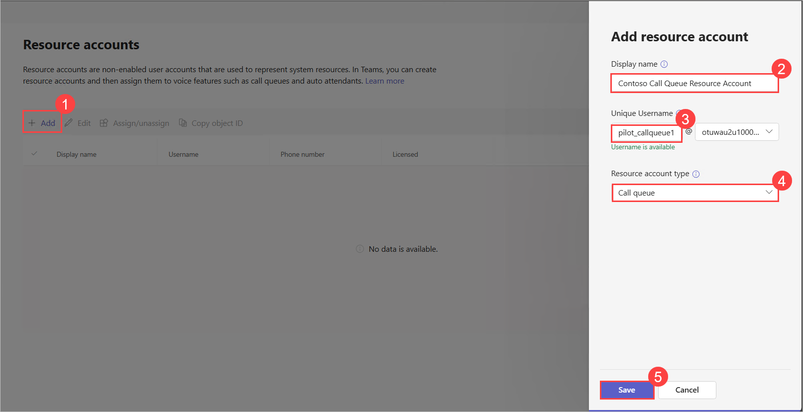

   > **NOTE:** If the error *You don't have the required permissions to create/manage resource accounts* appears, open the **Microsoft 365 admin center** (https://admin.microsoft.com) as **ODL User**. Select **Users** > **Active users**, and then select **Joni Sherman**. Select **Manage roles**, assign the **User Administrator** role, and then select **Save changes**. Sign out of the Teams admin center and sign back in as **Joni Sherman** before retrying.

1. Resource account is created for **Contoso Call Queue Resource account** and license is not assigned. 

	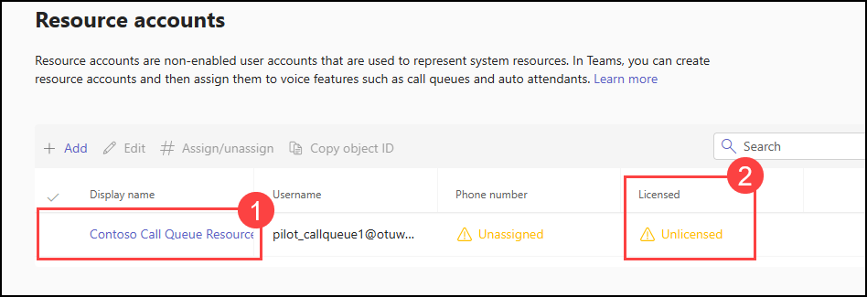

1. open the **Microsoft 365 admin center** in InPrivate window (https://admin.microsoft.com) as **ODL User** <inject key="AzureAdUserEmail" enableCopy="true"/>
and **password:** <inject key="AzureAdUserPassword" enableCopy="true"/>. Select **Users** > **Active users**, select **Contoso Call Queue Resource Account**

	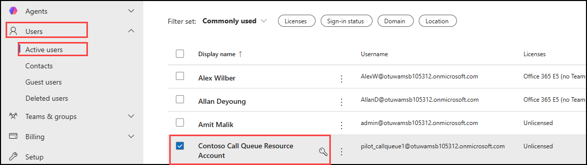

1. It navigates to user configuration details pane. Select the **Licenses and apps** tab and select the checkbox for **Microsoft Teams Phone Resource Account**.

	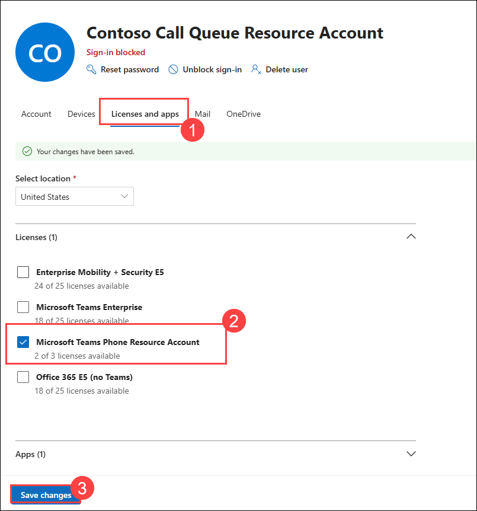

1. Go navigate back to **Teams admin portal** > Voice > Resouce accounts and check the license is added to **Contoso Call Queue Resource Account** and click on **Save changes**.

	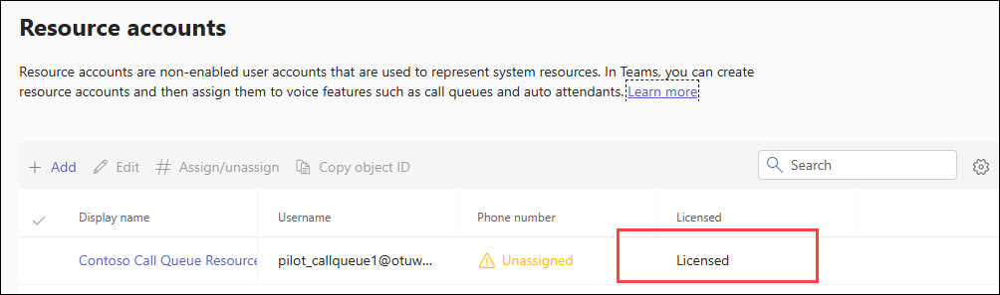

7. Download the file **Alarm03.wav** from the following link and save to the Downloads folder.

   [https://github.com/MicrosoftLearning/MS-700-Managing-Microsoft-Teams/blob/master/Instructions/Labs/media/Alarm03.wav](https://github.com/MicrosoftLearning/MS-700-Managing-Microsoft-Teams/blob/master/Instructions/Labs/media/Alarm03.wav)

	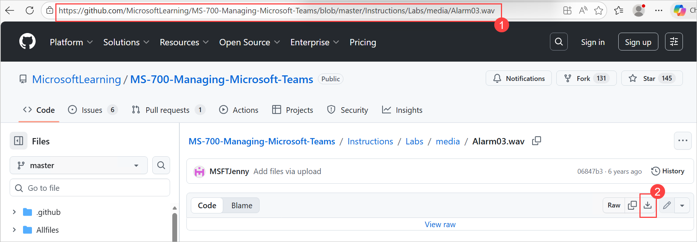

8. On the left navigation pane, select **Voice** and **Call queues**, to create a call queue.

9. Select **+ Add** from the top pane.

10. Click on **Classic Setup**.

	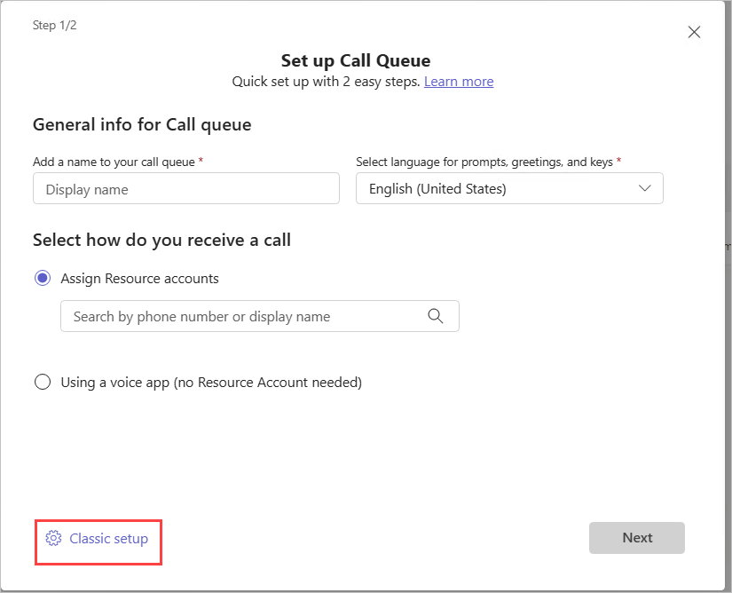

10. Enter the following information:

	- Call queue name: **Contoso Call Queue Resource Account (1)**

	- You haven’t added any resource accounts yet: Select **Add (2)**. On the right-side pane, search for **Contoso**, select **Add** from **Contoso Call Queue (3)**, and then select **Add (4)**.

		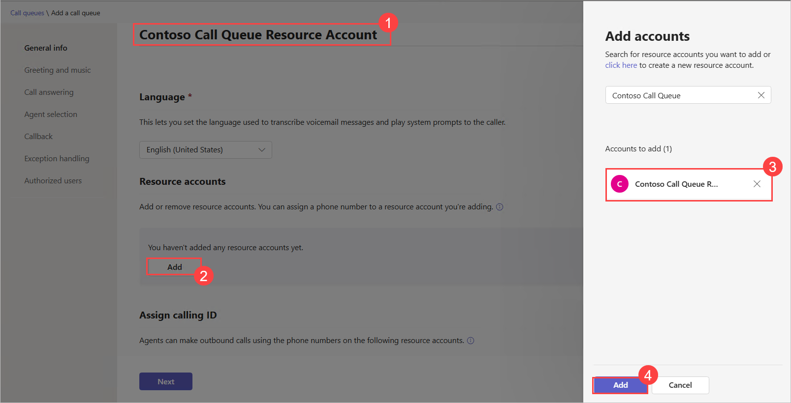
	
	- Language: **English (United States)**, then select **Next**.

	- Greeting: select **Play an audio file**, and then select **Upload file**.

	- In **Open** window, navigate to the Downloads folder, select **Alarm03.wav** and select **Open**.

	- Music on hold: **Play default music**, then select **Next**.

		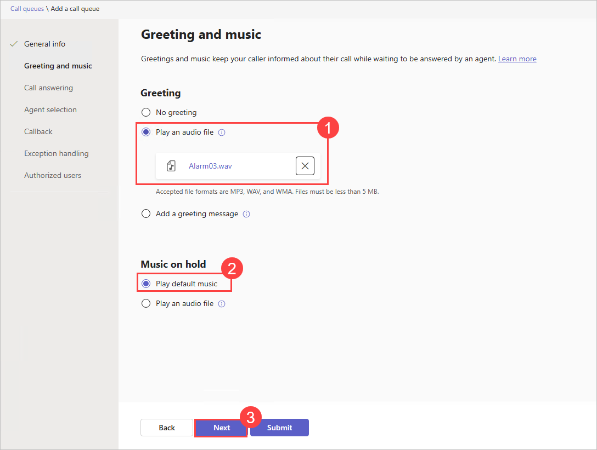

	- Call answering: Select **Choose users and groups** then select **Add groups** and on the right-side pane, search for **Sales**, select **Add** for **Sales** and then select **Add** at the bottom of the **Add call agents** pane. Select **Next**.

		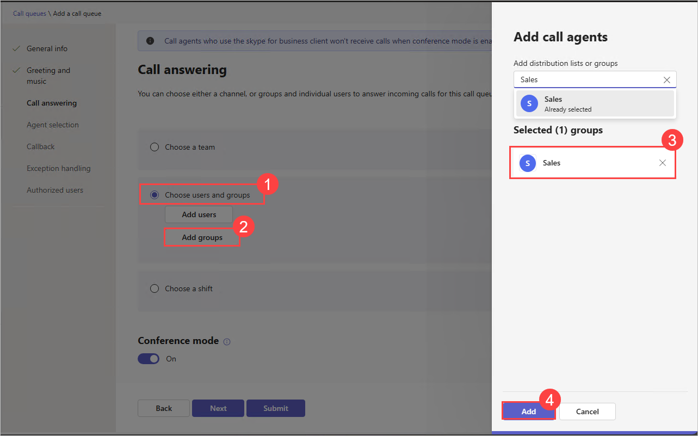

	- Routing method: **Round robin (1)**

	- Presence-based routing: **Off (2)**

	- Call agents can opt out of taking calls: **On (3)**

	- Call agent alert time: **30 seconds (4)**, select **Next (5)**.

		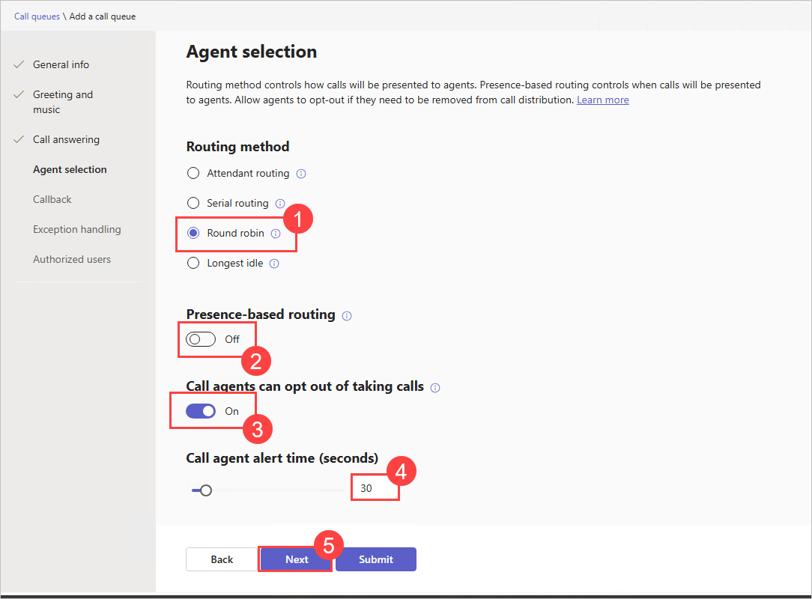

	- Under the **Exception handling** page, expand **Call overflow** and Maximum calls in the queue: **50**

	- When the maximum number of calls is reached: **Disconnect**

	-  Expand **Call timeout** and set Maximum wait time: **5 minutes**

	- When call times out: **Disconnect**

		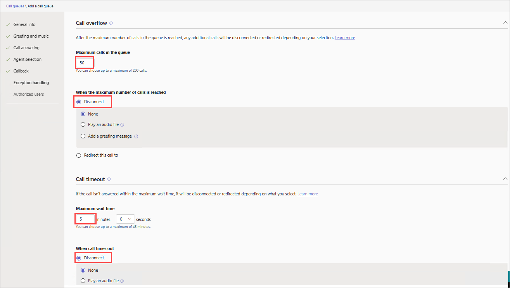

11. Select **Submit** to create the new call queue.

	Creating the new call queue may take some time, but you have successfully created a new custom call queue based on a resource account in your tenant.

	>**Note:** Because this call queue shall have a custom greeting, you need to upload some wav files for demonstration purposes. In a real-world scenario, you would record and prepare a greeting audio file and upload the audio file as shown in this task.

### Task 3 - Create an auto attendant

As Teams admin, you were tasked to create an auto attendant with a transcribed welcome message that will respond to customers outside of office hours. As some of your employees work in different time zones, the auto-attendant informs a caller that the subscriber is currently on vacation and to call another person in the organization. Furthermore, the auto-attendant informs callers about business hours.

> **Note** To complete this task the resource account you created should be assigned with a **Microsoft Teams Phone Resource account license**

1. Connect to the **Client 1 VM** and sign in with the Credentials that have been provided to you.

2. You should still be in the **Teams admin center** and signed in as **Joni Sherman** **<inject key="JoniSherman" enableCopy="true" style="color:blue" />** and Enter the **password** - <inject key="User04Password" enableCopy="true"/> 

3. On the left navigation pane, select **Voice**, and then choose **Resource accounts,** to create the resource account first.

4. On the **Resource accounts** page, select **+ Add (1)** from the top pane.

5. On the right pane, enter the following information:

	- Display name: **Contoso Auto Attendant (1)**

	- Username: **pilot_autoattendant1 (2)** 

	- Add **Domain name (3)** from dropdown.

	- Resource Account Type: **Auto attendant (4)**

		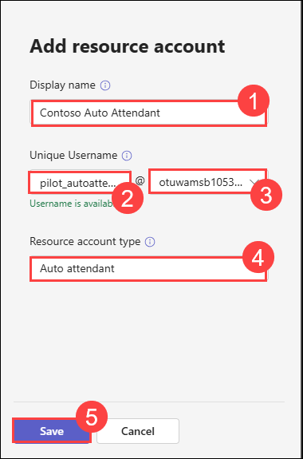

6. Select **Save (5)**.

1. open the **Microsoft 365 admin center** (https://admin.microsoft.com) as **ODL User** <inject key="AzureAdUserEmail" enableCopy="true"/>
and **password:** <inject key="AzureAdUserPassword" enableCopy="true"/> . 

1. Select **Users** > **Active users**, select **Contoso Auto Attendant**

 	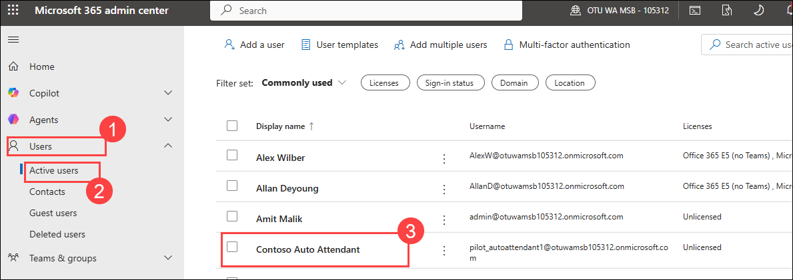

1. It navigates to user configuration details pane. Select the **Licenses and apps** tab and select the checkbox for **Microsoft Teams Phone Resource Account**.

	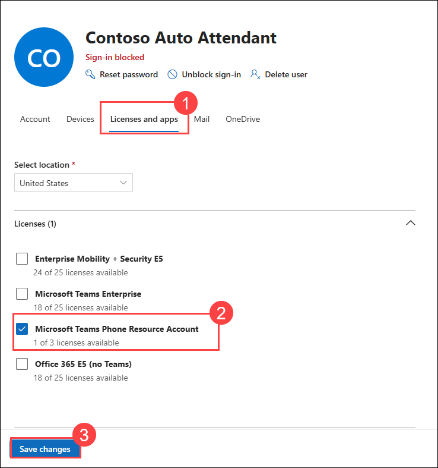

1. Resource account is created for **Contoso Auto Attendant** and license is Assigned
.
	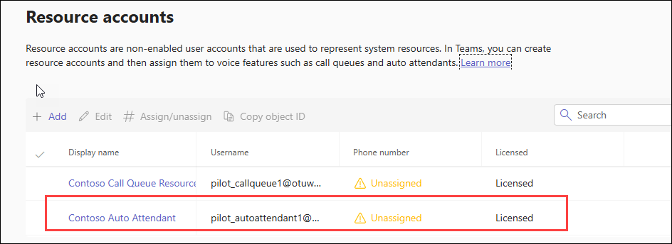

7. On the left navigation pane, select **Voice** and then **Auto attendants** below.

8. Select **+ Add** from the top pane, to create a new auto-attendant.

9. Click on **classic Setup** 

9. Enter the following information:

	- Add a name for your auto attendant: **Contoso Auto attendant**

	- Operator: **Voice app**

	- Search by resource account: **Contoso Call Queue Resource Account**

	- Time zone: **(UTC-08:00) Pacific Time (US &amp; Canada)**

	- Language: **English (United States)**

	- Enable voice inputs: **Off**

10. Select **Next**.

	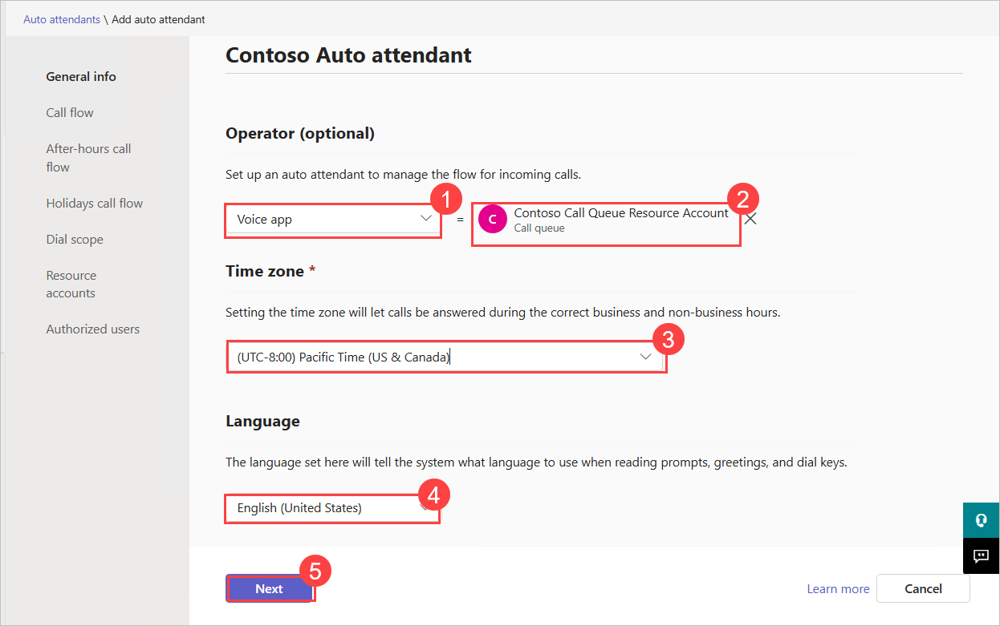

11. On the **Call flow** page, configure the following:

	- First, play a greeting message: Select **Add a greeting message (1)**

	- Type in: **Welcome. The person you called is currently on vacation, your call will be redirected to an operator. (2)**

	- Then under Call routing options select **Redirect call (3)**

	- Redirect to: **Voice app (4)**

	- Search by resource account: **Contoso Call Queue Resource Account (5)**

12. Select **Next (6)**.

	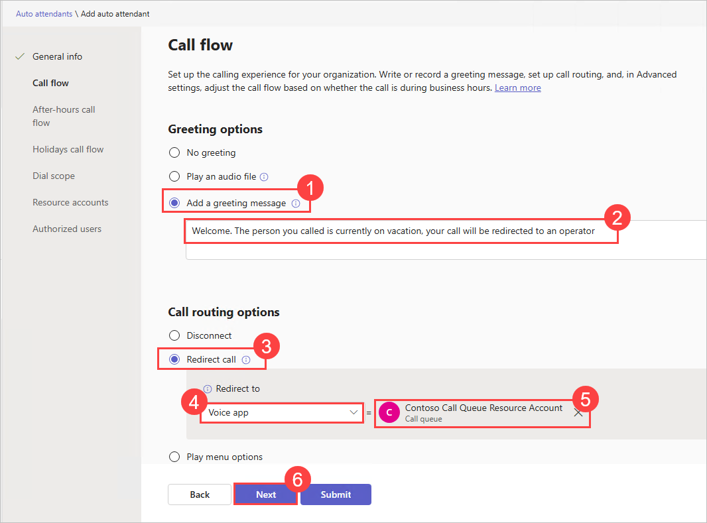

13. On the **Busines and after hours** page, configure the following:

	- Configure working hours **Monday** to **Friday** from **08:00 AM** to **04:00 PM**

	- Leave **Saturday** and **Sunday** blank.

	- Greeting options: **Add a greeting message**

	- Type in: **Thank you for your call, our business hours are Monday to Friday, 08:00 AM to 04:00 PM.**

	- Call routing options: **Disconnect**

14. Select **Next**.

	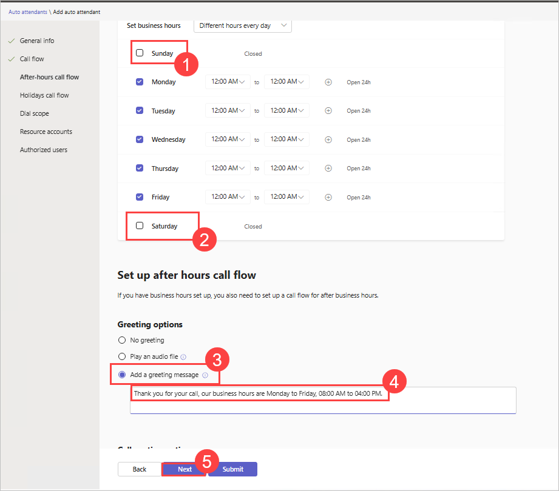

15. On the **Holiday call settings** page, select **Next**.

16. On the **Dial scope** page, select **Next**.

17. On the **Resource accounts** page, select **Add**. In the right-side pane, type **Contoso auto attendant**, and then select **Add** twice.

18. Select **Submit** to finish the creation of the auto attendant.

19. Close all browser windows.

You have successfully created a resource account for the auto attendant and then created an auto attendant configuration.

### **Exercise 5: Explore reports for call quality in Microsoft Teams**

When users experience calling problems, an organization's Teams administrator must quickly diagnose and fix the problems. The Teams client, the network, and any number of configuration issues in the Microsoft Teams admin center can disrupt an organization's users from effectively sending and receiving calls and participating in Teams meetings.

In this exercise, you'll explore the monitoring and troubleshooting tools available in Teams admin center, including call analytics, and the call quality dashboard to investigate voice issues.

Note: As we have not made any calls in this environment, reports will be blank and incomplete. 

### Task 1 – Explore call analytics for users, calls, and meetings

1. Connect to the **Client 1 VM** and browse to Teams admin center ([https://admin.teams.microsoft.com](https://admin.teams.microsoft.com/)) as **Joni Sherman** **<inject key="JoniSherman" enableCopy="true" style="color:blue" />** and Enter the **password** - <inject key="User04Password" enableCopy="true"/> 

2. In the left-hand navigation pane, select **Users&gt;Manage users**, and then select a **user**.

	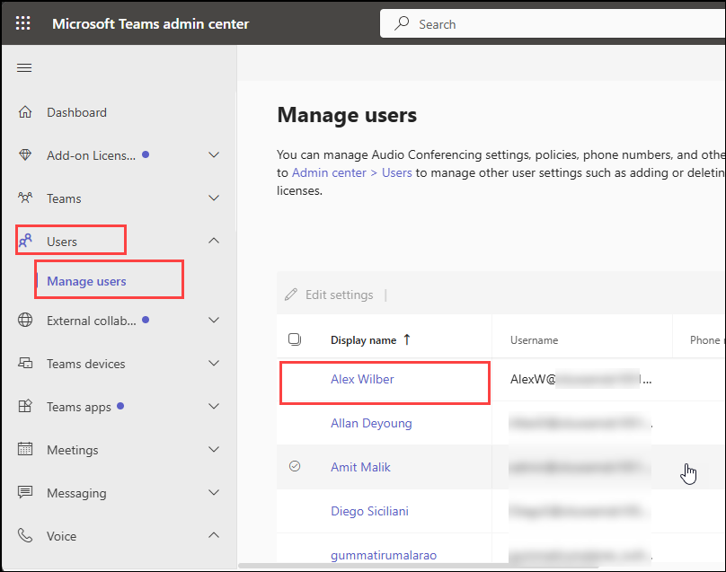

3. On the **User** page, select **Meetings &amp; calls** tab.

    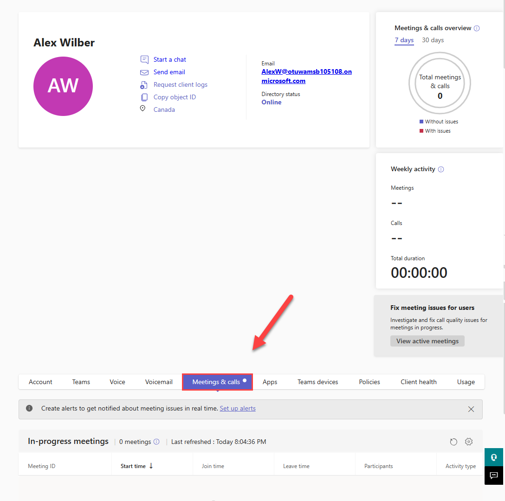

4. Call analytics page displays all calls and meetings for the selected user, 

By selecting a session in the list, you can view other information about a given session, including detailed media and networking statistics for call and meeting activities.

### Task 2 – Explore Call Quality Dashboard (CQD)

CQD is designed to help Microsoft Teams administrators and network engineers monitor call and meeting quality at an organization-wide level. The near real-time data enables Teams admins to quickly resolve issues by drilling down to find where issues originated, and who was affected.

In this task you navigate to Call Quality Dashboard

1. Connect to the **Client 1 VM** and browse to Teams admin center ([https://admin.teams.microsoft.com](https://admin.teams.microsoft.com/)) as **Joni Sherman** **<inject key="JoniSherman" enableCopy="true" style="color:blue" />** and Enter the **password** - <inject key="User04Password" enableCopy="true"/> 

2. In the left-hand navigation pane, select **Analytics & reports** then **Call Quality Dashboard**.

3. A new browser tab with the url [**https://cqd.teams.microsoft.com/**](https://cqd.teams.microsoft.com/) will open. You will be prompted to sign-in, when you access the CQD portal for the first time. Note: If there is an error when the new browser tab opens, simply  type in the browser: **https://cqd.teams.microsoft.com/**

4. When you first sign into the CQD Portal, you'll see the summary reports with daily and monthly call quality trends. Call quality is classified as good, poor, or unclassified. 

5. From the **Product Filter** dropdown menu, select **Microsoft Teams**.

	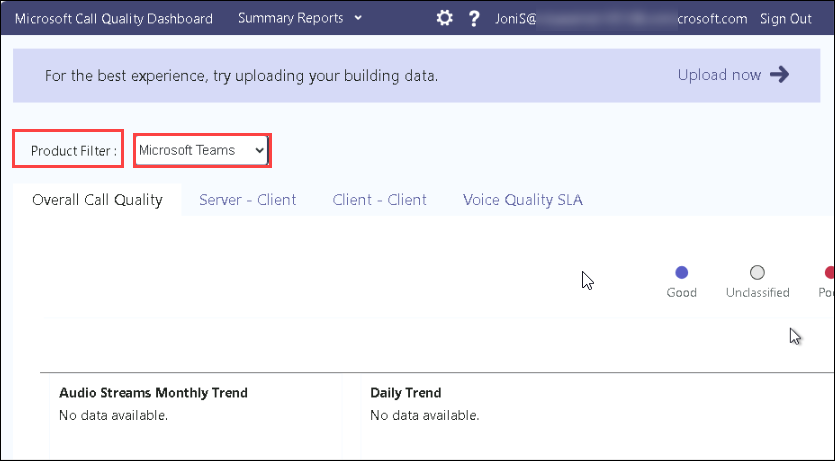

6. Explore the data under different tabs, including Overall Call Quality, Server-Client, Client-Client, and Voice Quality SLA.

In this exercise you have learnt how to access and navigate call analytics and Call Quality Dashboard.
 
### You have successfully completed this lab. 
