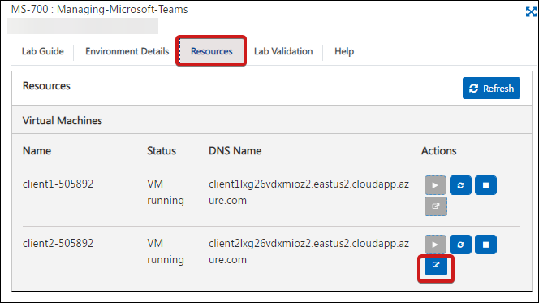

# Getting Started
## Log-in to the Azure Portal

1. Use the azure credentials provided in the **Environment Details** tab to log in to any portal.

1. Refer the **Environment Details** tab for any other lab credentials/details.

1. For accessing client2 Go to **Resources** tab, under resources click on launch button as shown below:

    
